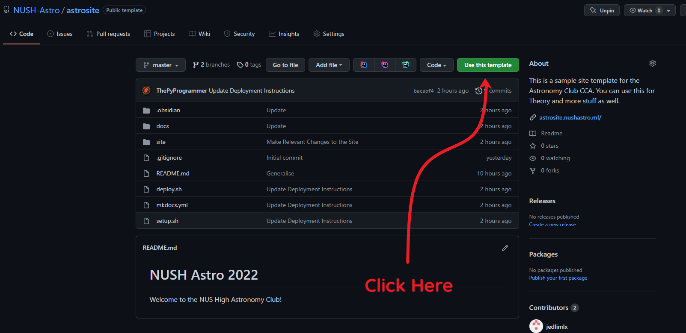
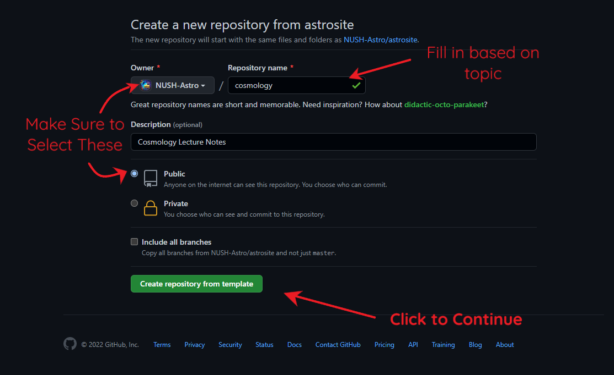
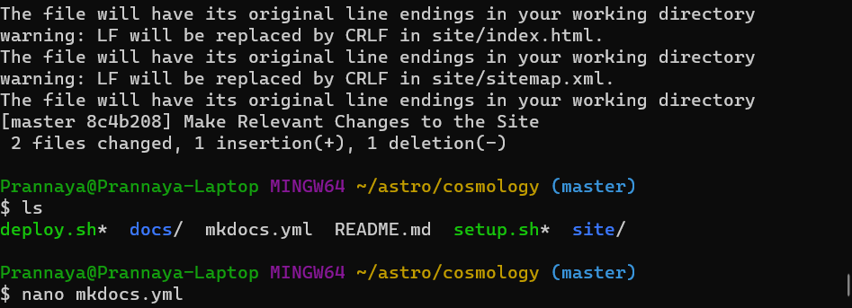
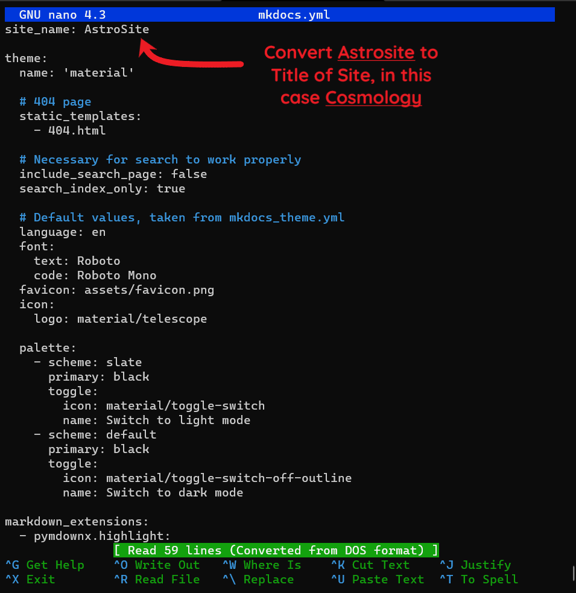
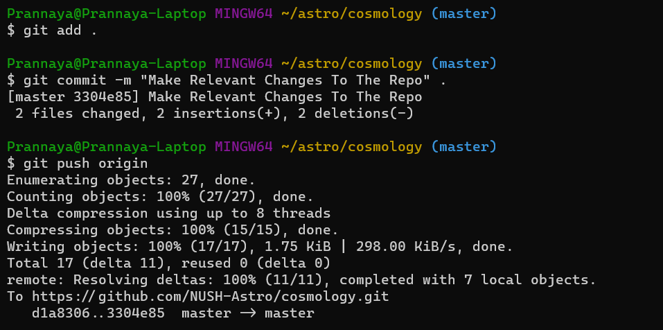

# astrosite

Astrosite is a basic template to create Astronomy-related Websites in MkDocs with Material as a theme. This is a sample site template for the Astronomy Club CCA. You can use this for Theory and more stuff.

See a feature listing at http://astrosite.nushastro.ml/ and get started at http://astrosite.nushastro.ml/Getting%20Started/!

## Getting Started

# Getting Started

How do you use `astrosite`? Here's a guide for you.

### Step 1: Create a Repo
Create a repo by going to  the [`astrosite` repo](https://github.com/NUSH-Astro/astrosite) and clicking "Use this template" as shown below:

This will lead you to another page to generate a repository from this template as shown below. Make sure to create this repo in the [NUSH-Astro](https://github.com/NUSH-Astro) GitHub Organisation and Provide a useful name and description for the repo. Make sure to make the repo public, otherwise deployment is not possible. Click "Create repository from template" when done.

### Step 2: Deal with the Repo
This will lead you to the newly created GitHub Repo, in this case [https://github.com/NUSH-Astro/cosmology](https://github.com/NUSH-Astro/cosmology), and you can now click the "Code" button and copy the Repo address as shown. This will be useful for downloading the repo and then administrating it.

Next, go to your terminal (for the purposes of this tutorial, I am using Git Bash), and clone the repository into a specific folder. Now, move into this newly created folder and run `./setup.sh` on some bash-supporting terminal.

### Step 3: Set-Up and Installation
This installation expects that you already have Python and Git Installed. If you don't, do install them from relevant sources.

Next, the setup file will install `mkdocs` and `mkdocs-material` from `pip` , allowing you to now convert these markdown files to HTML. Following this, it will open a `Nano` tab to input the name of the site. Make sure to convert `astrosite` to your preferred domain choice (domain choices have been stated, but can be added by contacting Prannaya), in this case `cosmo`. Press `Ctrl-O`, `Enter` and `Ctrl-X` when you are done.

Now, the setup file will deploy the site and you should probably be able to see the following messages:

This is mostly unimportant, but the main thing to note is that the CNAME file has been updated.

### Step 4: Minor Bugfixes

Now, need to open the `mkdocs.yml` file to change the name of the Site, simply by typing `nano mkdocs.yml` as shown.

From here, it opens the Nano Tab and you can change the site name from `AstroSite` to any name, containing some reference to the topic at hand. In this case, it has been renamed to `Cosmology`. Press `Ctrl-O`, `Enter` and `Ctrl-X` when you are done.

### Step 5: Deploy and Commit

From here, you can now deploy the site again by typing out `./deploy.sh` as shown.

From here, the site is now being deployed, and you can visit it in about 3 or 4 minutes. Till then, you can push the repo up by doing the following commands:

After this, you can simply access it from the site, in this case [http://cosmo.nushastro.ml/](http://cosmo.nushastro.ml/), as shown below:

And there you have it! A working site with editability based on Markdown (which also happens to support MathJax). I hope this helps you use this site. Thank you.