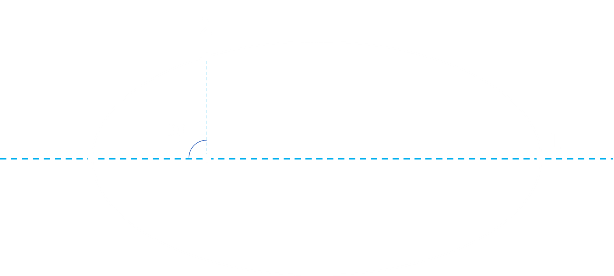

# Angular momentum

Read glencoe physics lmao

!!! Question

    === "Question"

        An observer is determining and approximate value of the orbital eccentricity of a man-made satellite.
        When the satellite is at apogee, it was pbserved to have moved by $\Delta\theta_1 = 2'44''$ in a short time.
        When the radius vector connection the Earth and the satellite was perpendicular to the major axis (i.e. true anomaly was equal to 90 degrees), the satellite was observed to have moved by $\Delta\theta_2 = 21'17''$ in the same amount of time.
        Assuming that the observer is located at the centre of the Earth, find an approximate value of the eccentricity of the satellite's orbit.

    === "Solution"

        From _conservation of angular momentum_ (of the satellite):

        $$mr^2\omega = \text{constant}$$

        Since mass $m$ is constant, and angular velocity $\omega$ is the rate of change of $\theta$, i.e. $\frac{d\theta}{dt}$:

        $$r^2\frac{d\theta}{dt} = \text{constant}$$

        And from this we can find $\frac{r_1}{r_2}$:

        $$\begin{align*}
        \frac{r_1^2}{r_2^2} &= \frac{\frac{d\theta_2}{dt}}{\frac{d\theta_1}{dt}}\\
        &= \frac{\Delta\theta_2}{\Delta\theta_1}\\
        &= \frac{21'17''}{2'44''}\\
        &= 7.787\\
        \therefore \frac{r_1}{r_2} &= 2.79
        \end{align*}$$

        We can also use the polar form of an ellipse. The true anomaly of the orbit is the angle from the periapsis to the object's current location as from the earth. So a true anomaly of 90 degrees is:

        

        Since we are measuring from the periapsis, $r=\frac{a(1-\varepsilon^2)}{1+\cos\theta}$

        $$\begin{align*}
        \frac{r_1}{r_2} &= \frac{\frac{a(1-\varepsilon^2)}{1+\varepsilon\cos\theta_1}}{\frac{a(1-\varepsilon^2)}{1+\varepsilon\cos\theta_2}}\\
        &= \frac{1+\varepsilon\cos\theta_2}{1+\varepsilon\cos\theta_1}\\
        &= \frac{1+\varepsilon\cos\frac{\pi}{2}}{1+\varepsilon\cos\pi}\\
        &= \frac{1}{1-\varepsilon}\\
        \therefore \frac{1}{1-\varepsilon} &= 2.79\\
        \therefore \varepsilon &= 0.64
        \end{align*}$$
