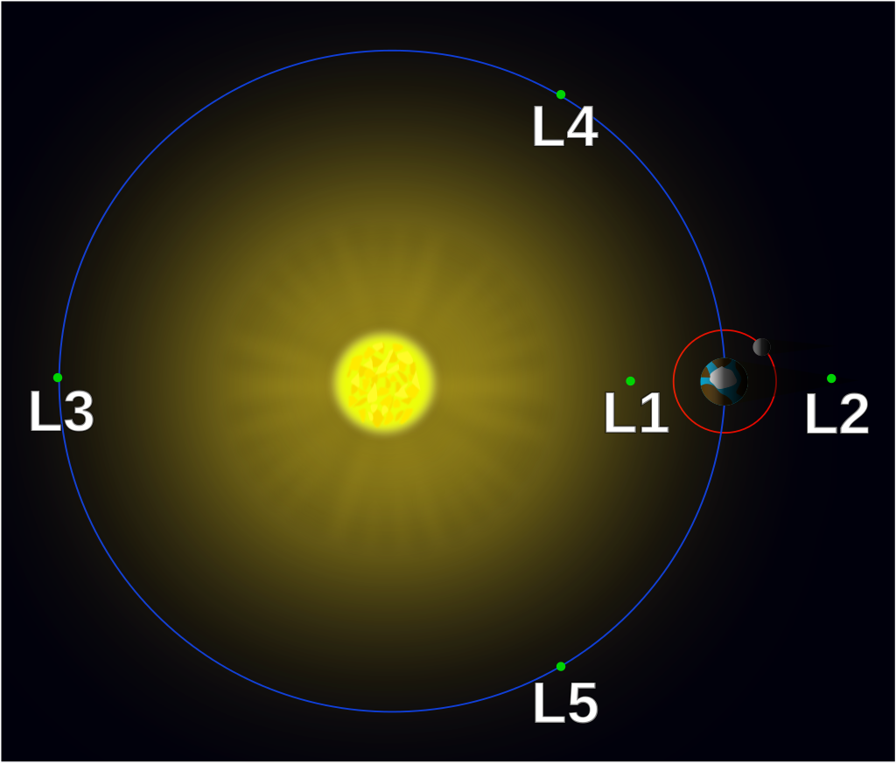
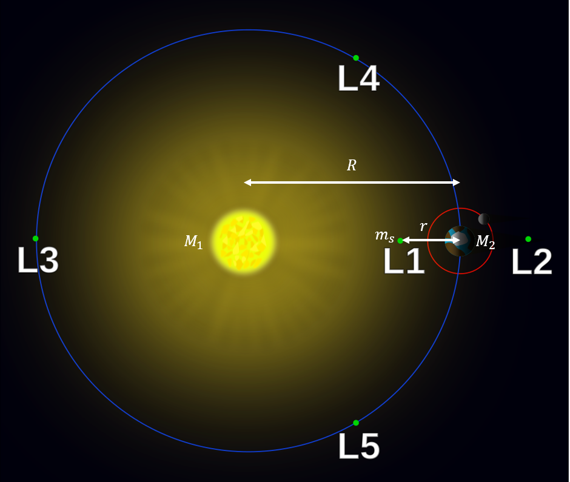
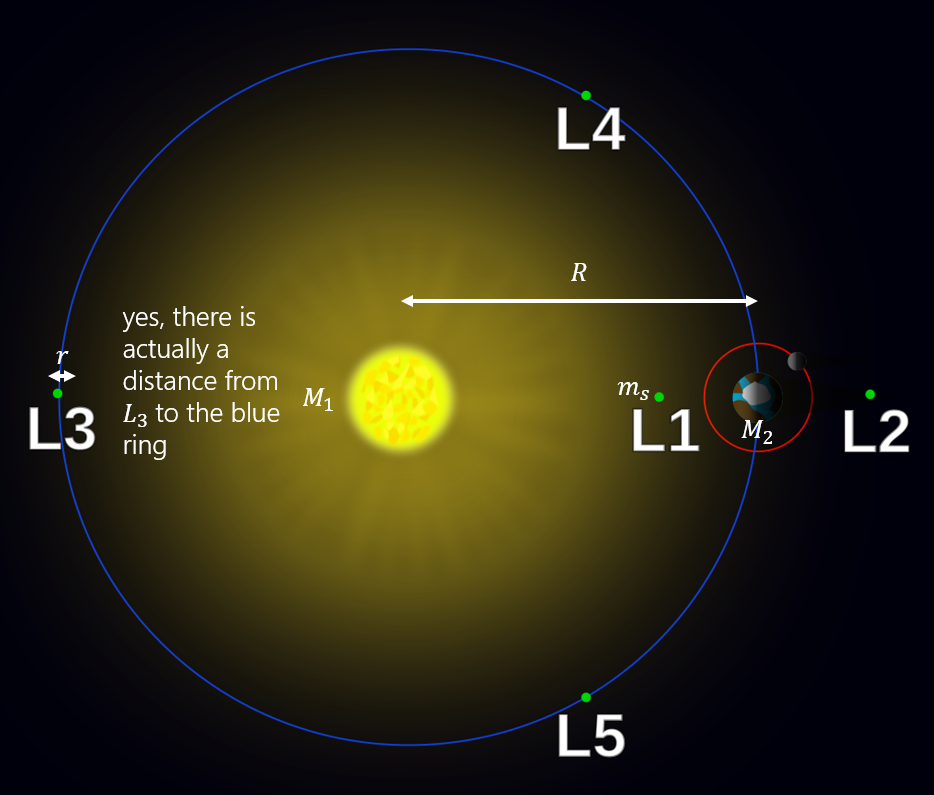
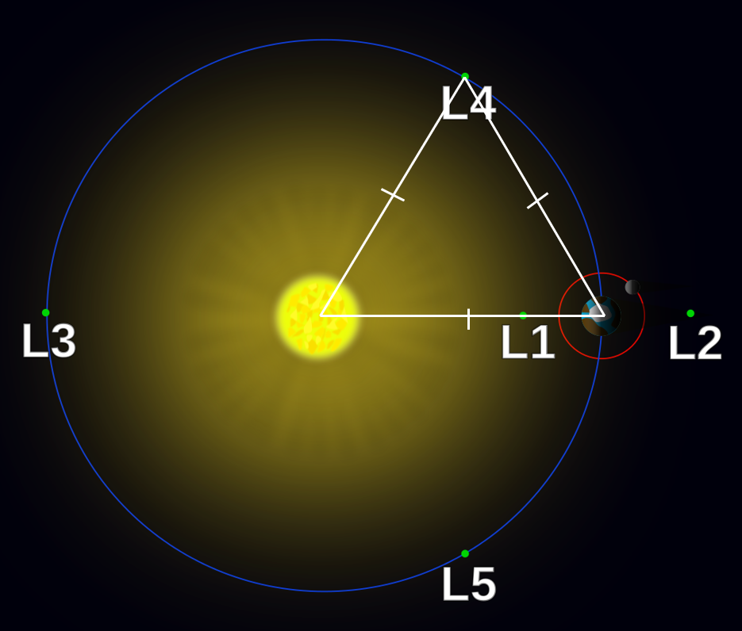
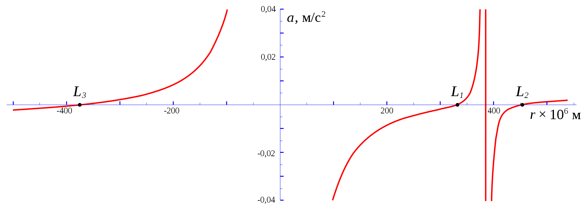

# Lagrange Points

Lagrange points are places in space where we can place a light object alongside 2 other heavy objects in orbit, such that the light object is in equilibrium. Accurately, that means:

!!! Quote "Lagrange points"

    Points of equilibrium for small-mass objects under the influence of two massive orbiting bodies.

This is especially useful for satellites, since the amount of adjustments needed to maintain orbit is minimised. For each 2 large bodies, there are **5** such points, $L_1$, $L_2$, and $L_3$ are on the line through the centres of the two large bodies, whereas $L_4$ and $L_5$ are a whole another thing of their own and deserve their own section, which we will talk about later.

!!! Note "A bit of history"

    As Wikipedia mentiones itself: "In an effort to avoid naming everything after Euler, some discoveries and theorems are attributed to the first person to have proved them after Euler". Alas, Lagrange didn't even discover Lagrange points, it was Euler. Well technically, Euler discovered the first 3 points and Lagrange discovered the other 2, but it can't even be called Euler points instead since that is already a thing.

<figcaption>The 5 Lagrange points for our Sun-Earth System</figcaption>

## $L_1$

$L_1$ is located in between the 2 masses. Qualitatively, we know from circular motion that the net force, which is the sum of the gravitational forces, is equal to the centripetal force. We can write that as such:

$$F_1-F_2=F_c$$

### $F_c$

To find $F_c$ we have to leverage what we know **specifically** about $L_1$. We know that it has to be collinear with the 2 masses, hence, if $M_2$ is orbiting around $M_1$, we know that $L_1$, will have to be in the same position relative to $M_2$, and so will have **the same angular velocity** as $M_2$.

So in other words, we can get the angular velocity of the satellite at $L_1$, which we will denote with $m_s$, by calculating the angular velocity of $M_2$, which we can then use to calculate $F_c$.

First, we equate the gravitational force on $M_2$, to its centripetal force.

$$\frac{G M_1 M_2}{R^2}=M_2 \space \omega^2 R$$

Some simple manipulation gives us the following:

$$\omega=\sqrt{\frac{G M_1}{R^3}}$$

Then we can calculate $F_c$ as follows:

$$F_c=m_s\space \omega^2 (R-r) = \frac{G M_1 m_s (R-r)}{R^3}$$

### Solving the equation

Anyways, we can write down the above equation mathematically and do some manipulation to reduce it to:

$$\frac{G M_1 m_s}{(R-r)^2}-\frac{G M_2 m_s}{r^2}=\frac{G M_1 m_s (R-r)}{R^3}$$

This is a quintic function. Before you lose all hope of solving this and move on to the next article, I would like to say that there is still some form of hope left. We can still use numerical methods, which won't be shown here.

But we can always get a solution if we try hard enough (read: approximate enough things). So, it turns out we can solve this if we assume $M_2<<M_1$. Sometimes, this is a valid assumption, for example, in the case of Earth-Sun.

The above equation can be rewritten as such:

$$\frac{M_2}{r^2}-\frac{M_1}{R^2} (1-\frac{r}{R})^{-2} + \frac{M_1}{R^2} (1-\frac{r}{R})=0$$

Which through a binomial expansion can be rewritten as:

$$
\begin{align*}
\frac{M_2}{r^2}-\frac{M_1}{R^2}(3\frac{r}{R}) &\approx 0\\
r&=R\sqrt[3]{\frac{M_2}{3M_1}}
\end{align*}
$$

Now we have found $L_1$!

## $L_2$

$L_2$ follows a similar (pretty much the exact same) approach.

We can write the new equation as follows:

$$\frac{G M_1 m_s}{(R+r)^2}+\frac{G M_2 m_s}{r^2}=\frac{G M_1 m_s (R+r)}{R^3}$$

Using the same solving approach, we can approximate the position of $L_2$ to be:

$$r \approx R \sqrt[3]{\frac{M_2}{3 M_1}}$$

Note that just because the solution to $r$ is the same doesn't mean $L_1$ and $L_2$ are at the same place! The diagram shows that $r$ in each case represent distance in opposite directions.

## $L_3$

$L_3$ once again follows a similar approach with a new equation (I think you can see why Euler was able to easily spot the first three once he spotted the first):

$$\frac{G M_1 m_s}{(R-r)^2}+\frac{G M_2 m_s}{(2R-r)^2}=\frac{G M_1 m_s (2R-r)}{R^3}$$

Using the exact same solving approach, we can write the solution as follows:

$$r\approx R \frac{7M_2}{12M_1}$$

## $L_4$ and $L_5$

This is where it gets mildly weird. The positions of these places are best explained qualitatively, and it is not done in the same way as for $L_1$, $L_2$ and $L_3$, which is why they were discovered seperately by different people.

$L_4$ and $L_5$ form an equilateral triangle with both masses. Because of this, the gravitational forces are still in the same ratio as the masses of the bodies, and so the resultant force points towards the centre of mass (barycenter) of the system. This is an incredibly important result because the barycenter is the centre of rotation, and this is precisely what allows $L_4$ and $L_5$ to be in orbital equilibrium, orbiting with the same angular velocity as the other Lagrange points.

!!! Note "For those interested"

    $L_4$ and $L_5$ were actually discovered by Lagrange when he was working on a solution to the infamous three-body problem. Turns out, the problem actually has a solution when we take the mass of the third body to be really small compared to the other 2 masses.

## Graphical intuition

If you aren't satisfied enough with the above dull results, perhaps a graph will help.

On the line that passes through both masses, we can equate the centripetal force to the net gravitational force and obtain this expression for the radial acceleration:

$$a = -\frac{GM_1}{r^2}sgn(r)+\frac{GM_2}{(R-r)^2}sgn(R-r)+\frac{G((M_1+M_2)r-M_2 R)}{R^3}$$

where $sgn(x)=\frac{x}{|x|}$.

We can hence plot $a$ against $r$ and obtain the below graph:

<figcaption>Net radial acceleration of a point orbiting along the Sun-Earth line</figcaption>

The intersections at zero represent the first three Lagrange points. The qualitative trend of the graphs is very helpful to remember as well.

## Mathematical Derivation
Disclaimer (although it should be obvious): this requires PO.

Let's start by representing the masses at each point as $m_1$, $m_2$ and $m_3$, and let $\vec r_1$, $\vec r_2$ and $\vec r_3$ represent the position vectors of said points based off an arbitrary origin point on the plane with all 3 points. The centre of mass of said system has the following position vector:

$$\vec r_{\text{cm}} = \frac{m_1\vec r_1 + m_2\vec r_2 + m_3\vec r_3}{m_1+m_2+m_3}$$

Let's denote the distance between any two masses $m_i$ and $m_j$ to be $r_{ij}$. We state that these points are in fact moving in a circular motion about said centre-of-mass. To simplify the situation, let's denote $\vec r_{\text{cm}}$ as the origin. This would mean that:

$$
\begin{align*}
\vec r_{\text{cm}} &=  \vec 0 \\
\frac{m_1\vec r_1 + m_2\vec r_2 + m_3\vec r_3}{m_1+m_2+m_3} &= \vec 0 \\
m_1\vec r_1 + m_2\vec r_2 + m_3\vec r_3 &= \vec 0 \\
\text{Thus for any }m_k,& \\
\vec r_k &= -\frac{1}{m_k} \left(\sum m_j\vec r_j \right) \\
\end{align*}
$$

From here, let's say we wish to determine the gravitational force exterted by a given mass $m_i$ on another mass $m_j$, $F_{g, ij}$ we can determine this by plugging in Newton's Law of Universal Gravitation.

$$
\begin{align*}
\vec F_{g,ij} &= G\frac{m_i m_j}{r_{ij}^3} \vec r_{ij} \\
&= Gm_i m_j \left(\frac{\vec r_i - \vec r_j}{|\vec r_i - \vec r_j|^3} \right)
\end{align*}
$$

Thus, for instance for mass 1, masses 2 and 3 exert differing forces $\vec F_{g, 21}$ and $\vec F_{g, 31}$ which can be summed up to compute the overall centripetal force of motion.

$$
\begin{align*}
\vec F_{g,21} &= Gm_1 m_2 \left(\frac{\vec r_2 - \vec r_1}{|\vec r_2 - \vec r_1|^3} \right) \\
\vec F_{g,31} &= Gm_1 m_3 \left(\frac{\vec r_3 - \vec r_1}{|\vec r_3 - \vec r_1|^3} \right) \\
\vec F_{g,1} &= Gm_1 \left[ m_2 \left(\frac{\vec r_2 - \vec r_1}{|\vec r_2 - \vec r_1|^3} \right) + m_3 \left(\frac{\vec r_3 - \vec r_1}{|\vec r_3 - \vec r_1|^3} \right) \right] \\
\end{align*}
$$

This is the centripetal force here from the centre of mass.

$$
\begin{align*}
m_1(\vec r_1) \omega^2 &= Gm_1 \left[ m_2 \left(\frac{\vec r_2 - \vec r_1}{|\vec r_2 - \vec r_1|^3} \right) + m_3 \left(\frac{\vec r_3 - \vec r_1}{|\vec r_3 - \vec r_1|^3} \right) \right] \\
\omega^2 &= G\left[ m_2 \left(\frac{\vec r_2 - \vec r_1}{|\vec r_2 - \vec r_1|^3} \right) + m_3 \left(\frac{\vec r_3 - \vec r_1}{|\vec r_3 - \vec r_1|^3} \right) \right] \cdot \vec r_1 \\
\omega &= \sqrt{G} \sqrt{\frac{m_2}{|\vec r_2 - \vec r_1|^3} \left(\vec r_2 \cdot \vec r_1 - r_1^2 \right) + \frac{m_3}{|\vec r_3 - \vec r_1|^3} \left(\vec r_3 \cdot \vec r_1 - r_1^2 \right)}
\end{align*}
$$

(TBC)

## Applications

If you are wondering, if these Lagrange points are so good at maintaining orbital equilibrium, why doesn't NASA just put its satellites there? The thing is, they do. The recently launched James Webb Space Telescope (JWST) orbits the Sun-Earth system at $L_2$!

<figcaption>Gaia (yellow) and James Webb Space Telescope (blue) orbits around Sun-Earth system at L2</figcaption>

I still think they should be called Euler points.
