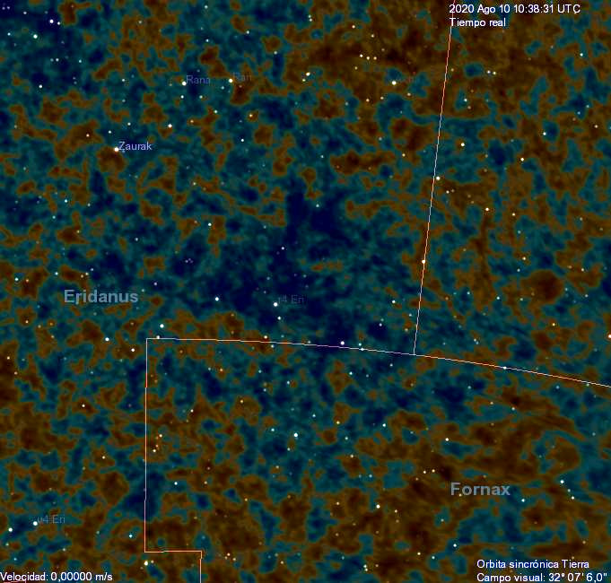

# Cosmic Microwave Background

## Discovery

In 1964, astronomers Arno Penzias and Robert Woodrow Wilson were using their very large telescope (not called that) for radio astronomy purposes. They found a signal corresponding to microwaves of wavelength 7.35 cm, even after removing all the sources of noise they could have thought of. This signal was uniform in all directions (i.e. isotropic), and did not come from the Earth, Sun or Moon. They concluded that this signal was coming outside the Milky Way.

## Origin

As it turns out, this radiation is a relic from the earliest times of the universe. When the universe was much younger, it was much smaller, and matter was all compressed together, much like in the core of a star. So, all of matter was plasma, with no neutral atoms existing as the radiation was too strong and would ionize these atoms immediately. When the universe expanded and cooled down, the radiation (light) was redshifted, increasing wavelength and decreasing their energy. This meant that the photons of light could not ionize the atoms anymore, and could pass through the cooling gas without being absorbed.

When the universe expanded enough to let the above happen, the photons were now free to pass through the expanding universe. This is called the surface of last scattering, ending the recombination epoch at 378000 years after the start of the universe. 

Although this radiation was full of energy during recombination, the expansion of the universe in these billions of years have caused the light to be redshifted immensely, and we can only observe this light at a much longer wavelength corresponding to microwave radiation. This is why this phenomenon is called the Cosmic Microwave Background.

## Big Bang

But what was this 'start of the universe'? We can extrapolate by turning back the clock and undoing the expansion of the universe. This leads to the universe contracting down to a single point, containing every single thing in the universe. This state is called a singularity (since we've effectively multiplied all distances by 0), and the resulting expansion is the Big Bang. 

### Location

Let's get this out of the way first: "Where did the Big Bang happen?"

The Big Bang happened everywhere. This may seem counterintuitive, but remember: the singularity contained all of space in a single point, and the universe expanded. So, *every point in space* was where the Big Bang happened!

This may be easier to see with our expanding balloon analogy. As we deflate the balloon to a single point, the ants rush together, with their distances decreasing down to 0. When the balloon is completely deflated (radius = 0), all the ants are at the same point, and each can think that they were where the inflation started from!

## Isotropy

### Dipole

We've stated earlier that the signal (CMB) was uniform in all directions. This is a bit of a lie.

The CMB has a significant dipole moment, as shown below. The blue parts are cooler and the red hotter.

<figure markdown>
  { width="450"}
  { width="450"}
  <figcaption>Dipole moment</figcaption>
</figure>

This near perfect dipole is caused by our motion, specifically our motion toward a point in the constellation Crater, close to its boundary with Leo. The Earth is moving around the Sun, the Sun around the Milky Way, etc. Therefore, some of the light coming from the CMB has been Doppler shifted, resulting in a higher temperature toward one side, and a lower temperature toward the other.

If the above doesn't concern you, it should. The Earth, as a whole, is moving relative to... *what*? Relativity states that there is no special, universal reference frame that we can use for an absolute coordinate system, and that all frames are equally relative.

The answer is mean: we are moving relative to the average velocity of all energy in the universe, comprising of matter, radiation, dark matter, etc. This frame is called the Cosmic Rest Frame, and does not break our Relativity, as we can measure our velocity relative to this frame. It just turns out that this frame is more important than other frames, as it encompasses the average velocity of everything in the universe.

We can somewhat conceptualize this by imagining a globular cluster. The entire globular cluster can be seen as moving through space based on the velocity of its center of mass. If we focus a single star, chances are that it won't be moving with the same velocity as the cluster's center of mass. This relative velocity is similar to our own relative velocity relative to the average velocity of all energy, just that the cluster of mass is the entire universe. This observation will hopefully make the dipole of the CMB easier to understand.

When we remove the relative motion part from the CMB, we get this image:

<figure markdown>
  { width="450" }
  <figcaption>The Cosmic Microwave Background</figcaption>
</figure>

This figure is somewhat isotropic, with some very minor irregularities. However, there are still a few creases we need to wrinkle out, or at least acknowledge.

### Other Isotropy problems

First, there is no reason for the CMB to be isotropic. If we look at opposite sides of the sky, we see that they're about the same temperature based on the photons emitted. But, if the photons are reaching us now, how would these completely separate parts of the sky interact with each other in the early universe to achieve thermal equilibrium? The photons couldn't have reached each other if they're only reaching us now!

<figure markdown>
  { width="480"}
  { width="480"}
  <figcaption>The Horizon Problem</figcaption>
</figure>

This is the horizon problem, one of the problems with the Hot Big Bang model. We will revisit this when discussing cosmic inflation, which expanded the universe by an astoundingly large factor close to the Big Bang.

Second, there are still some patterns in the anisotropy of the CMB. The quadrupole and octupole moments of the CMB appear to have some alignment with each other, and are aligned with the ecliptic plane as well. When this was first identified from the results of the Wilkinson Microwave Anisotropy Probe (WMAP), some chalked it up to errors. However, the results from the more accurate Planck Telescope still had signs of anisotropy.

<figure markdown>
  { width="450" }
  <figcaption>Cold Spot in Eridanus (centre)</figcaption>
</figure>

There are also some large structures in the CMB, including the "Cold Spot" in Eridanus, which are quite big and are unlikely to form. Some have proposed a very large void to explain the decrease in temperature, making it one of the largest structures in the universe. 

This is the axis of evil problem (yes, really). Some have called it as a *massive* coincidence. However, further studies in these have found the anisotropy to not be statistically significant, and there are doubts on the significance of the Cold Spot. As of now, there is no broad consensus of its origin or non-significance.