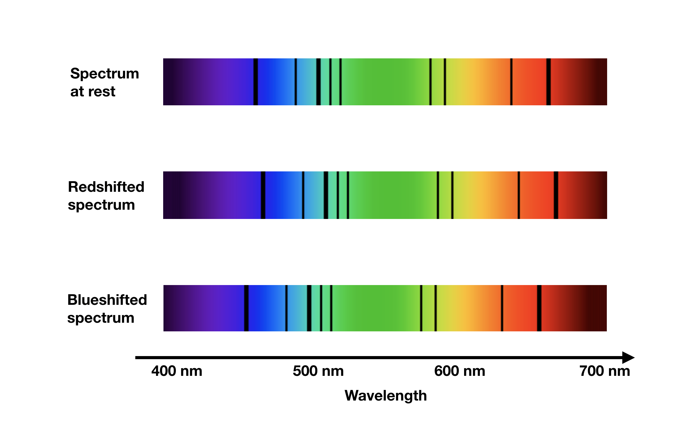

# Galactic Redshift

## Observations

In 1912, Vesto Slipher observed that the absorption lines in some galaxies was shifted toward the red side of the spectrum. 

The absorption lines came from stellar light that passed through some cool gas (or stellar atmosphere) in the galaxy, leading to absorption at specific frequencies of light corresponding to the difference in energy levels for the atoms in the gas. The frequency and energy difference is related by $E=hf$.

<figure markdown>
  { width="450" }
  <figcaption>Emission and absorption of photons</figcaption>
</figure>

The atoms in the gas absorb light in these frequencies, resulting in dark bands in the continuous spectrum of light, called absorption lines. These absorption lines are useful as they have well-defined wavelengths, and any deviation from the actual wavelength can be measured.

In this case, all the absorption lines from the distant galaxy were shifted toward the red part of the spectrum, as shown in this diagram:

<figure markdown>
  { width="450" }
  <figcaption>Redshift and blueshift</figcaption>
</figure>

## Doppler effect

One simple way to explain this is that these galaxies are moving *away* from us very quickly, so much so that the Doppler effect for light is now a factor (not exactly the case - we will re-examine this when we discuss redshift again).

The Doppler effect for sound is intuitive, and commonly found in daily life. The distortion of an ambulance siren is an example, with the siren sounding high-pitched when the ambulance is approaching, low-pitched when leaving. The observed frequency for sound follows the formula:

$$f=\frac{c \pm v_r}{c \mp v_s}f_0$$

Where $c$ is the wave speed, $v_r$ and $v_s$ are the receiver and source velocities respectively. Use the top sign if the receiver/source is moving *toward* the other.

Light is somewhat similar, although Special Relativity does complicate this.

$$\lambda_r = \sqrt{\frac{c+v}{c-v}}\lambda_0$$

With a positive recession velocity (v), the observed wavelength increases, the frequency decreases and the absorption line is moved toward the red side.

(If you're worried about the lack of detail here, redshift will be discussed in greater detail later. This section is basically a history of cosmology's development.)

## Hubble's Law

Edwin Hubble took some of Slipher's data and compared the velocities with distance measurements to these galaxies, using the cosmic distance ladder. He found a wonderful relation: the recession speed was proportional to the distance to the galaxy! We now call this Hubble's Law.

$$v = H_0 d$$

Here, $H_0$ is the Hubble constant, which stands at around 70 km/s/Mpc, $\pm$ quite a bit, due to something called Hubble Tension, a disrepancy in the measured Hubble constant from different methods.

What could be causing such galaxies to rush away?

## Expanding Universe

As it turns out, the universe is expanding uniformly. Distances to faraway objects like these galaxies increase over time, and appear to rush away from our point of view. The best analogy is inflating a balloon. Imagine blowing up a balloon, with little ants on it. From the point of view of an ant on the balloon, all of the other ants are moving away, simply because there is now more space between each ant. And the further out the ant is, more space gets created proportionally, very much like Hubble's Law!

<figure markdown>
  { width="450" }
  <figcaption>I hope this looks like a balloon to you</figcaption>
</figure>

Note that this does not mean we're the 'center' of the universe. If we switch to the point of view of another ant, we find that *we* are now the galaxy receding, and all other galaxies will similarly follow Hubble's Law.