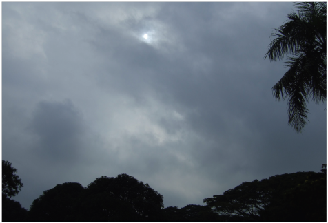
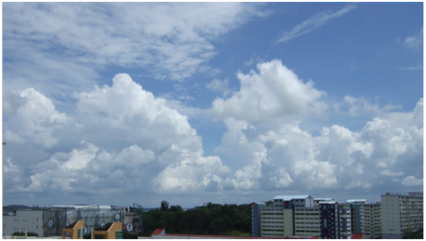
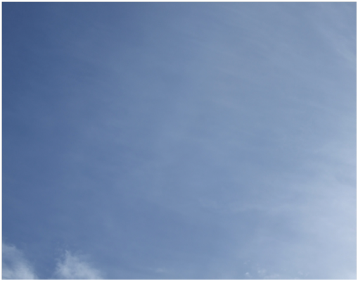
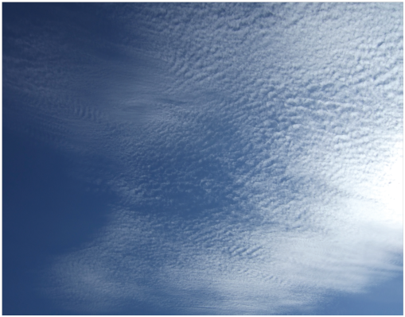

# Clouds

Clouds are ubiquitous is Singapore, but there are in fact **10 basic** types of clouds. They are often classified by how high above the ground their **base** is.

## Low Clouds

Low clouds are usually composed of water droplets, though cumulonimbus clouds include ice crystals, and have a base below 2 km.

### Stratus

Stratus clouds are low, grey clouds that typically form in sheets or layers, often obscuring the tops of tall buildings.

In Singapore, shallow fog or mist often forms in forested areas during the night.
At daybreak, the mist lifts to form patches of stratus gradually rising above the ground.
Ragged patches of stratus, called stratus fractus, can also form beneath rain clouds.
This is often seen here during periods of prolonged rain experienced in the Northeast Monsoon.

### Cumulus

Cumulus clouds are easily recognisable fluffy white clouds usually on a sunny day.
They are formed via thermal convection when heat from the ground warms the air up and causes them to rise.

Cumulus clouds can combine together and form clouds with deeper convection.
Such clouds can evolve into _Cumulus congestus_, a towering cumulus cloud.
Those may continue to grow into _Cumulonimbus_ clouds.

### Stratocumulus

These clouds can be thought of as a combination of Stratus and Cumulus clouds.
These often look like a greyish or white sheet with rolls or clumps, which is a sign of weak convection.

These are often found over large areas of the ocean.

### Cumulonimbus

These clouds are responsible for the thunderstorms you experience in Singapore.
Althought these are "Low Clouds" (due to having a low base), these clouds extend up high into the Troposphere, which in the tropics is about 15 kilometers high.

> Cumulonimbus with its anvil-shaped top sheared by higher level winds

You can think of cumulonimbus as a better vesion of cumulus.
However, the defining feature that separates cumulonimbus from cumulus congestus is the presence of ice crystals at the top of the cloud.
You can tell when a cumulus congestus becomes a cumulonimbus when its top appears to be more "frayed out" and fibrous rather than looking like a cauliflower.

These clouds only last about one hour most of the time, but under certain conditions some cumulonimbus clouds manage to regen.

## Medium Clouds

Medium clouds are usually composed of water droplets or a mixture of water droplets and ice crystals, and have a base of between 2 km and 7 km.

### Altostratus

Altostratus clouds are pretty boring clouds that cover a decent chunk of the sky, and may even be thick enought to block out the sun.
Optical phenomeno like iridescence can also be observed through thin altostratus.

In the tropics altostratus clouds usually form from the remnants of convective weather systems (e.g. thunderstorms) that have since dissipated.

### Altocumulus

Altocumulus consists of rounded, individual masses with clear sky showing between them.
In the tropics they also usually come from dead convective weather systems (e.g. thunderstorms).

The difference between altocumulus and altostratus is that in altocumulus, some instability is present such that weak convection takes place, giving rise to individual convective cells.

### Nimbostratus

This is a multi-level cloud that is formed usually in the mid-latitudes, and is very rare in Singapore, so you can ignore it.
It is formed when a mass of warm air is moving into a mass of cold air (warm front), which does not happen in Singapore because there is no cold air [citation needed].

It is placed in Medium Clouds because it generally starts forming in this height range and spreads upwards and downwards.

Although this cloud is non-convective it is capable of producing rain, ice pellets or snow.

It is basically very thick altostratus that rains.

## High Clouds

High clouds are made of ice crystals, as it is colder the higher you go up, and often have a base somewhere between 5.5 - 14 kilometers above the ground.

### Cirrus

Cirrus clouds are clouds that are mainly made out of ice crystals. They often look like a feather or a wisp.

In the tropics, cirrus are often formed from dead thunderstorms - the anvil of a cumulonimbus cloud is effectively large shield of cirrus.
Since upper level winds are usually strong, these cirrus cloud tops are often carried far downwind from the thunderstorm.
Large, thick patches of cirrus often last far longer than the parent cumulonimbus cloud.

Precipitation from cirrus clouds never reaches the ground as the ice crystals falling down often melt and evaporate away long before they can reach the ground

### Cirrostratus

This cloud is very thin and often hard to notice, despite it being rather common.
It is also made of ice crystals, and can often make the sky look "milky"

### Cirrocumulus

Cirrocumulus consists of many small cloud elements, which are shaped like tufts and ripples.

Like all other high-altitude clouds, it is mainly made out of ice crystals.
However, cirrocumulus also contains some supercooled water.
When that freezes of it becomes cirrostratus.

Like all other cumuliform (cumulus-like) clouds, this is a sign of convection.
