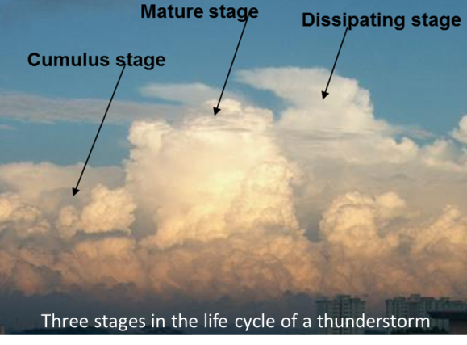
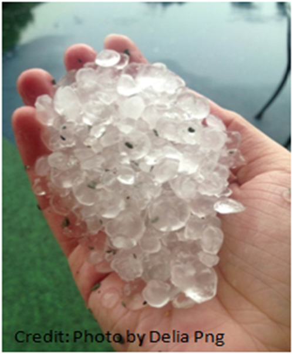

# Weather Systems

There are three major weather systems that cause heavy rain in Singapore:

1. Localized thunderstorms caused by strong daytime heating
2. Sumatra squalls - and organised line of thunderstorms that develop over Sumatra or the Straits of Malacca
3. Moonsoon surges - sudden strengthening of winds in the Northeast Monsoon flow

## Thunderstorms

Thunderstorms are the most powerful of everyday weather events, and can bring heavy rain, lightning, and sometimes hail. Most thunderstorms are associated with cumulonimbus clouds.

### Formation

Cumulonimbus clouds normally form on warm, sunny days.
Solar radiation heats the earth’s surface during the day, which in turn warms the lowest layer of air.
As the warm and humid air rises, it cools and condenses to form clouds, which grow larger and larger as more warm air rises.

Not all cumulonimbus clouds bring thunderstorms; some just bring moderate to heavy showers.
On average, an individual cumulonimbus cloud takes about an hour to grow and dissipate, and produces less than thirty minutes of thunder and lightning.
If a thunderstorm lasts longer than this, it is probably because there is more than one cumulonimbus cloud present.

Thunderstorms occur all year round in Singapore, but are more prevalent during the inter-monsoon periods (April-May and October-November).

### Phenomena

Thunderstorms often bring heavy rains and strong winds, as well as lightning and thunder.
They are also capable of producing microbursts, [hail](https://www.youtube.com/watch?v=EzUjghLO3qc) and waterspouts.

### Lightning

Lightning is a large electrical spark of very short duration during a thunderstorm.
Inside a thunderstorm cloud, an enormous electrical charge slowly builds up; the charge is then discharged in a blinding flash, as lightning zig-zags between ground and cloud.

There are three types of lightning: intra-cloud lightning, inter-cloud lightning, and cloud-to-ground lightning.
Intra-cloud lightning is the most common while inter-cloud lightning is the least common.
The most dangerous type, cloud-to-ground lightning, makes up about 20% of all lightning.
Inter-cloud lightning is often a precursor to cloud-to-ground lightning.

The highest incidence of lightning activity typically occurs in November followed by April and May.
These are the Inter-Monsoon months when the predominantly light and variable winds favour the development of localised and intense thunderstorms.  
On average, the Inter-Monsoon months account for more than 50% of the lightning strokes in a year.

{ width="480px"}

> cloud-to-cloud lightning (Changi Meteorological Station)

Most lightning strokes occur within 5-6 km of a thunderstorm cloud.
In the absence of a thunderstorm in a location, lightning strokes from a distant thunderstorm cloud more than 10 km away could still affect that location.
Such a lightning strike is known as a “bolt from the blue”.
Such lightning strikes are likely from the anvil to the cloud to the ground.

{ width="480px"}

> cloud-to-ground lightning (Pasir Ris)

Thunder is the sharp or rumbling sound which accompanies lightning.
It is caused by the intense heating and expansion of the air along the path of the lightning.
The rumble of thunder is caused by the noise passing through layers of the atmosphere at different temperatures.

### Microburst

Rain falling from a thunderstorm cloud can drag the surrounding air downwards to produce a downdraft.
This downdraft in turn spreads out upon reaching the ground, resulting in gusty winds that can cause damage to the surrounding area if the downdraft is intense and strong.

A microburst is an intense downdraft that occurs over a small localized area, typically with a horizontal extent of less than 4 km.
They have a brief lifespan reaching maximum intensity within 10 minutes, and can generate wind speeds of more than 270km/h.

> Schematic of a microburst with its characteristic “curling of air” upon strong impact with the ground. Ignore the airplane.

As a microburst is a small scale feature that forms and dissipates very quickly, it remains a challenge to forecast when a microburst will occur, and to issue timely warnings of its expected occurrence.

This is often a danger to airplanes but we are not YFC so we do not care.

### Hail

Hail stones form in an intense thunderstorm (cumulonimbus) cloud when raindrops freeze at high levels and then grow steadily in size as they are recycled through powerful updrafts and downdrafts, or strong vertical winds.
They compose of transparent irregular ice pieces or alternating layers of ice, ranging in size from a few millimetres to a few centimetres in diameter.
Once a hailstone becomes too heavy to be supported by the thunderstorm’s updraft, it falls out of the cloud.

> hail from [an intense thunderstorm event in 2013](https://www.youtube.com/watch?v=EzUjghLO3qc&t=16s)

In the tropics, the atmosphere is often warmer with the freezing level usually at altitudes greater than 5 km.
Therefore, hail formed in the upper atmosphere usually melts before reaching the ground.
However, it is still possible for hail to form under particularly strong updrafts of intense thunderstorms, with the updrafts carrying and sustaining the growth of hail high up in the atmosphere.
Correspondingly strong downdrafts help to drive the hail down to the ground before it has completely melted.

Sightings of hail stones have been reported in Singapore every few years on average.
Hailstones that reach the ground here tend to be small compared to those formed in the mid-latitudes.

### Waterspouts

A waterspout is a rotating column of air often associated with intense thunderstorms over the sea.
They are like tornados but over sea and weaker.

They are also called "funnel clouds" and they usually have a diameter of 50m.
It might look like the thunderstorm is sucking up water, but it's actualy just water droplets in a rotating vortex of air that is rising.
As the air rises it cools and condenses making it visible.

It on average lasts about 10 minutes, but some bigger ones can last up to 1 hour.
They tend to move at around 30 km/h, and pretty much die as soon as they get near the coast.
At sea they can put swimmers and small boats at risk but apart from that they can't do much damage.

{width="480px"}

## Sumatra Squall

A Sumatra squall is an organised line of thunderstorms that originate over Sumatra Island or the Strait of Malacca, and typically move eastward towards Singapore and the surrounding region under the influence of southwesterly or westerly winds.

It commonly occurs during the Southwest Monsoon and Inter-monsoon periods, and usually affects Singapore overnight or in the morning.
A Sumatra squall is often characterised by a sudden onset of strong gusty surface winds of 40 to 80km/h and heavy rain lasting from 1 to 2 hours as it moves across the island.
Maximum gusts (sudden increses of wind speed) of up to 93 km/h have been recorded during the passage of a Sumatra squall.

> Radar animation of a Sumatra squall affecting Singapore in the predawn hours

## Monsoon Surge

During the northern hemisphere winter (December – March), high pressure systems frequently develop over continental northern Asia, and bring dry conditions and cold subsiding air over the northern Asian landmass.
At times, a sudden increase in wind speed causes the cold subsiding air to surge southwards into the South China Sea towards low pressure systems in the southern Hemisphere.
This sudden surge of cold air is referred to as a Northeast Monsoon surge.

As the cold winds surge southwards over the South China Sea, it warms and gathers moisture, leading to the formation of dense rain clouds over the equatorial region.
On occasions when the winds are particularly strong, they can bring moderate to heavy showers/rain and occasional thunderstorms to coastal regions in Southeast Asia such as Vietnam, Peninsular Malaysia, and Singapore.
The showers can be continuous and prolonged, lasting from 2 to several days.
The Northeast Monsoon Surges occur more often and are more intense during the early part of the Northeast Monsoon season (November – January) than in the latter half of the season (February - March).
Surges that occur during the dry phase of the Northeast Monsoon typically bring strong winds but there are no accompanying showers.

On average, Singapore experiences 2 to 4 monsoon surges each year. Each event can last between 1 and 5 days where widespread continuous moderate to heavy rain affects the island. Sometimes the surges come in spells with breaks of cloudy or overcast conditions.

> Radar animation showing multiple spells of showers affecting Singapore during a Monsoon Surge
