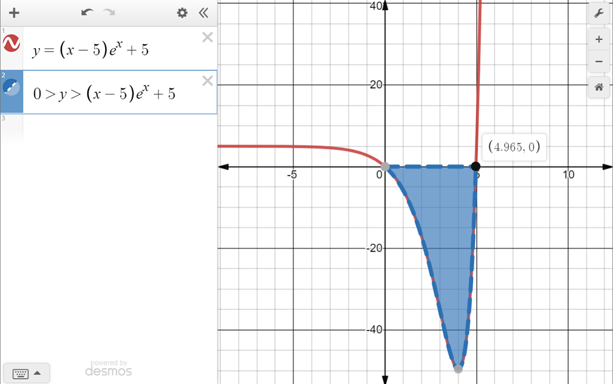

# Wien's Displacement Law

Before learning about Wien's Displacement Law, we need to understand its history.

## Ultraviolet Catastrophe

It is the turn of the 20th century. At this point, physicists had proved without a shadow of a doubt that light was a wave. This is done via the double slit experiment which was carried out by Thomas Young in 1801.

### The Problem

<figure markdown>
{ width="470" }
{ width="470" }
<figcaption>The spectrum of light emitted by a perfect blackbody.</figcaption>
</figure>

However, when physicists tried to predict the radiation coming from a blackbody under the assumption that light was a wave, obtained an equation now known as the Rayleigh-Jeans Law. At high frequencies, it predicted that the power emitted
by a blackbody would tend to infinity as the frequency increased. This clearly did not match up with experimental results
which showed that there was a peak wavelength of radiation that a blackbody would emit.

This was the ultraviolet catastrophe, called as such since the experimental results deviated significantly at ultraviolet wavelengths.

### Solution

In 1900, Max Planck heuristically derived the correct form for the intensity spectral distribution function by making some strange (for the time) assumptions. In particular, Planck assumed that electromagnetic radiation can be emitted or absorbed only in discrete packets, called quanta, of energy:

$$E_{\text{quanta}}=h\nu =h{\frac {c}{\lambda }}$$

where $h$ is Planck's constant, $\nu$ is the frequency of light, $c$ is the speed of light and $\lambda$ is the wavelength of light.
Planck's assumptions led to the correct form of the spectral emission intensity function:

$$
E_\lambda=\frac {2hc^2}{\lambda^5} \cdot \left(e^{\frac{hc}{\lambda k_BT}}-1\right)^{-1}
$$

This formula provide the emission intensity in form $E_\lambda$. The reason why it has a $\lambda$ attatched to the bottom of it is because $E$ depends on the wavelength $\lambda$. (This variable is also affected by changes in Temperature $T$ but shhhhhhhhhhhhh).

Here, $k_B$ is simply **Boltzmann's Constant**, often standardised as:

$$\begin{align*}k_B &= 1.3806504 \times 10^{-23} \cdot J/K \\&\approx 1.38065 \times 10^{-23} \cdot J/K\end{align*}$$

!!! Note "Another way to find $k_B$"

    Another way to determine $k_B$ is by representing it as a fraction of the Ideal Gas Constant, $R$ as depicted below:

    $$\begin{align*}R &= 8.314462618 \cdot J/mol\cdot K \\&\approx 8.314 \cdot J/mol\cdot K \\&\approx 0.08206 \cdot \frac{L \cdot atm}{mol \cdot K}\end{align*}$$

    with Avogadro's constant, subject of his very famous formula, which we all learnt back in Y1, as shown below:

    $$\begin{align*}N_A &= 6.02214076 \times 10^{23} \cdot mol^{-1} \\&\approx 6.02 \times 10^{23} \cdot mol^{-1}\end{align*}$$

    Hence we get the following:

    $$\begin{align*}k_B &= \frac{R}{N_A} \\&= 1.380648999974554 \times 10^{-23} \cdot J/K \\&\approx 1.38065 \times 10^{-23} \cdot J/K\end{align*}$$

    And we use this value to our benefit.

Albert Einstein (in 1905) and Satyendra Nath Bose (in 1924) solved the problem by suggesting that Planck's quanta were _real physical particles_ (photons), not just a mathematical fiction.
They modified statistical mechanics in the style of Boltzmann to an ensemble of photons.
Einstein's photon had an energy proportional to its frequency.
This published postulate (a.k.a. suggestion) was specifically cited by the Nobel Prize in Physics committee in their decision to award the prize for 1921 to Einstein.

## Wien's Displacement Law

Wien’s displacement formula gives the wavelength that a blackbody radiate which releases the highest spectral emission intensity. The following shows the formula:

$$
\lambda_{max} = \frac{b}{T} \approx\frac{0.002898 m \cdot K}{T}
$$

where $T$ is the temperature of the surface of the star (from which radiation is emitted). The constant $b \approx 0.002898 m \cdot K$ is known as _Wien’s Wavelength Displacement Constant_.

!!! Question

    	=== "Wait how do they know how hot the sun is"

    		Given that $\lambda_{max}$ of the sun is approximately 500nm, find the temperature of the surface of the sun (photosphere).

    	=== "Solution"

    		$$T = \frac{0.002898}{500\times 10^{-9}}= 5800K$$

### Derivation

!!! Note

    What is going on here? Please don't try this at home. It's not safe for anyone to mentally do this, unless you're me* (Prannaya), of course. As you may know, your club director is insane.

    *There are multiple people who wrote this site so "me" is ambiguous

This formula can be derived by maximising the emission intensity, $E_\lambda$ as per Planck's aformentioned law. Since we aim to determine the maximum wavelength, we essentially let $T$ be constant while differentiating by $\lambda$. This is essentially a partial differentiation action, and we use $\frac{\partial}{\partial \lambda}$, as we depicted below.

$$\frac{\partial E_\lambda}{\partial \lambda} = 2hc^2 \cdot \frac{\partial}{\partial \lambda} \left(\frac {1}{\lambda^5} \cdot \left(e^{\frac{hc}{\lambda k_BT}}-1\right)^{-1} \right) = 0$$

We compute the differential as follows:

$$\left(e^{\frac{hc}{\lambda k_BT}-1}\right)^{-1} \frac{\partial}{\partial\lambda}\left(\frac{1}{\lambda^5}\right) + \frac{1}{\lambda^5}\frac{\partial}{\partial\lambda}\left(\left(e^{\frac{hc}{\lambda k_BT}}-1\right)^{-1}  \right) = 0$$

As you can see, this is torture. We hence try to kinda simplify it (this isn't going to work, is it?):

$$-5\left(\lambda^6 e^{\frac{hc}{\lambda k_BT}-1}\right)^{-1} - \lambda^{-5} \left( e^{\frac{hc}{\lambda k_B T}}-1\right)^{-2} e^{\frac{hc}{\lambda k_B T}} \times \frac{-hc}{\lambda^2 k_B T} = 0$$

From here, the equation can be simplified to:

$$
\frac{hc}{k_BT\lambda}e^{\frac{hc}{\lambda k_BT}} = 5e^{\frac{hc}{\lambda k_BT}} - 5
$$

Letting $x = \frac{hc}{\lambda k_BT}$, we get the following expression:

$$xe^x = 5(e^x - 1)$$

If we decide to define a variable $y$, we get $y = (x-5)e^x + 5$, and from here we can plot $y$ out and identify the roots of $y$.

This is, in fact, analytically solved via the Lambert W~~acky~~ Function to get $x \approx 4.965114231744276303$. We then let $\lambda_{max} = \frac{hc}{xk_BT}$.

To derive these values, let's use Phyton (totally not free publicity).

From here, we can get the precise value for $b$ to be $2.897771955185172661 \text{ mmK}$.

### Understanding the Planck Distribution

Now say you experimentally sample the intensity of a blackbody at many different wavelengths. If you do this for all wavelengths, you will get Planck’s distribution, the maximum of which can be found using Wien’s displacement formula. Different stars have different surface temperatures, which give different blackbody distributions with different peak wavelengths. This explains why hotter stars appear blue – their peak wavelengths are the shortest. Of course, it’s not just blue light that is reaching us: the star only appears blue because that is the dominant form of visible light that is reaching us. The same applies for reddish, cooler stars.
