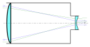

# Refractor

!!! Danger "Remove this once the section on abberations is complete"

A refractor telescope is a type of optical telescope that uses a lens as its objective to form an image. Refracting telescopes typically have a lens at the front, then a long tube, then an eyepiece or instrumentation at the rear, where the telescope view comes to focus.

!!! Note "A bit of history"

    These were the earliest kind of telescopes. In 1608, a guy named Hans Lippershey tried to patent one and failed. Galileo Galilei heard of this "failure", made one of his own, discovered a couple of things and then was sentenced to prison.

## Galilean refractors

These use a convergent (plano-convex) objective lens and a divergent (plano-concave) eyepiece lens. It results in a non-inverted and upright image. It works because the objective lens is able to gather more light and focus it, more than what the human eye alone could do. 

Ignoring the fact that this has major flaws causing the images to be blurry and distorted, it was good enough for Galileo to see craters on the Moon, four largest moons of Jupiter and the phases of Venus. 

## Keplerian refractors

The Keplerian telescope, invented by Johannes Kepler in 1611, is an improvement on Galileo's design. It uses a convex lens as the eyepiece instead of Galileo's concave one. The advantage of this arrangement is that the rays of light emerging from the eyepiece are converging. This allows for a much wider field of view and greater eye relief, but the image for the viewer is inverted (but no one cares about that if we can see the thing). Considerably higher magnifications can be reached with this design. 

The only major problem with this, was abberations, more of which we will see later in the next section, but for now, just know that its not good. To overcome this issue, we would need to have a larger focal length. So a man called Johannes Hevelius thought, why don't we just make the telescope bigger? (I wish I was joking).

<figcaption>Why don't we just make it 46m longer?</figcaption>

## Achromatic refractors

So people thought, instead of making it longer and longer and longer and longer and longer and longer and longer and longer and longer and longer and longer and longer, why don't we just change the lens?

And so came the achromatic lens, reducing chromatic and spherical abberation. Thus, we no longer needed longer telescopes, but only better lenses.

## Apochromatic refractors

These refractors used lenses that are built with special, extra-low dispersion materials. These are essentially better than achromatic lenses at minimized chromatic and spherical aberrations, as explained in the previous section (which doesn't exist as of now).

## Problems

While aberrations are minimized, they are still there, especially at shorter focal lengths. In very large apertures, there is also a problem of lens sagging, a result of gravity deforming glass. Since a lens can only be held in place by its edge, the center of a large lens sags due to gravity, distorting the images it produces.

There is a further problem of glass defects, small air bubbles trapped within the glass. In addition, glass is opaque to certain wavelengths, and even visible light is dimmed by reflection and absorption when it crosses the air-glass interfaces and passes through the glass itself. 

So, astronomers tried making better versions, but all refractors seemed to suffer from these same issues. And so, they turned to overhauling the design, and trying out a new kind of telescope - Reflectors.