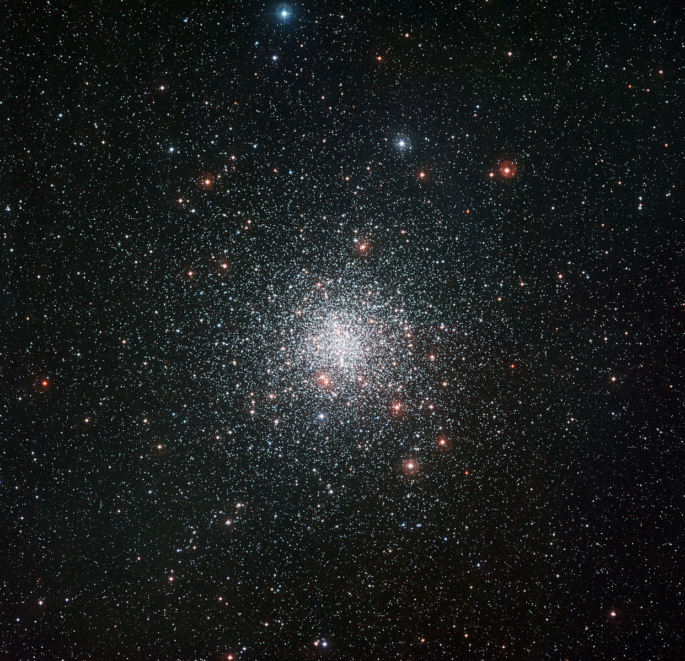

# List of DSOs

Legend:

| Annotation |    Meaning    |
| :--------: | :-----------: |
|  **Bold**  | Constellation |
| _Italics_  |     Star      |

## List of Messier Objects

{width="480"}

### M1 (Crab Nebula)

<figure markdown>
    { width="480px", align=right}
    <figcaption>Messier 1, the Crab Nebula, a <a href="https://en.wikipedia.org/wiki/Supernova_remnant">Supernova remnant, that does not look like a crab at all</a></figcaption>
</figure>

!!! Success "How to find"

    Find “V” shape in **Taurus**

    “V” shape branches into _Elnath_ (**Auriga**) and _Tianguan_ From _Tianguan_, move 1° in the direction of _Elnath_

    

??? Info

    |      Property          |                   Value                      |
    | :--------------------: | :------------------------------------------: |
    |  **Right Ascension**   | 05h 34m 30s |
    |    **Declination**     |                +22° 00′ 52.2″                |
    |      **Distance**      |          6500±1600 ly (2000±500 pc)          |
    |  **Visual magnitude**  |                     8.4                      |
    | **Apparent Dimension** |                    6′x4′                     |

    > sources: [for distance](https://arxiv.org/abs/0801.1142), [for everything else](http://www.messier.seds.org/m/m001.html)

### M2

<figure markdown>
    { width="480px", align=right}
    <figcaption>Messier 2, a <a href="https://en.wikipedia.org/wiki/Globular_cluster">Globular cluster</a></figcaption>
</figure>

!!! Success "How to find"

    Find the second star on the long arm of **Aquarius** (_Sadalsuud_) Draw a line to closest leg end of **Pegasus** (_Enif_)

    Move 4°45’ in the direction of this line from _Sadalsuud_

    

??? Info

    |        Property        |                      Value                      |
    | :--------------------: | :---------------------------------------------: |
    |  **Right Ascension**   | 21h 33m 27.02s |
    |    **Declination**     |                 -00° 49′ 23.7″                  |
    |      **Distance**      |                55000 ly (17 kpc)                |
    |  **Visual magnitude**  |                       6.5                       |
    | **Apparent Dimension** |                      16.0′                      |

    > sources: [for distance](https://arxiv.org/abs/1804.09381), [for everything else](http://www.messier.seds.org/m/m002.html)

### M3

<figure markdown>
    { width="480px", align=right}
    <figcaption>Messier 3, a <a href="https://en.wikipedia.org/wiki/Globular_cluster">Globular cluster</a></figcaption>
</figure>

!!! Success "How to find"

    Find **Coma Berenices**

    On the side pointing to **Bootes**, extend in the direction of the line by 6°51’

    Or, Approximately 12° top right of _Arcturus_

    

??? Info

    |        Property        |                      Value                      |
    | :--------------------: | :---------------------------------------------: |
    |  **Right Ascension**   | 13h 42m 11.62s |
    |    **Declination**     |                 +28° 22′ 38.2″                  |
    |      **Distance**      |               33.9 kly (10.4 kpc)               |
    |  **Visual magnitude**  |                       6.2                       |
    | **Apparent Dimension** |                      18.0′                      |

    > source: http://www.messier.seds.org/m/m003.html

### M4 (Crab Globular Cluster, Spider Globular Cluster)

<figure markdown>
    { width="480px", align=right}
    <figcaption>Messier 4 (aka Crab <a href="https://en.wikipedia.org/wiki/Globular_cluster">Globular cluster</a> or Spider <a href="https://en.wikipedia.org/wiki/Globular_cluster">Globular cluster</a>)</figcaption>
</figure>

!!! Success "How to find"

    Beside _Antares_

    

??? Info

    |        Property        |                      Value                      |
    | :--------------------: | :---------------------------------------------: |
    |  **Right Ascension**   | 16h 23m 35.22s |
    |    **Declination**     |                 -26° 31′ 32.7″                  |
    |      **Distance**      |                7.2 kly (2.2 kpc)                |
    |  **Visual magnitude**  |                       5.9                       |
    | **Apparent Dimension** |                      36.0′                      |

### M5 (Rose Cluster)

<figure markdown>
    { width="480px", align=right}
    <figcaption>Messier 5, a <a href="https://en.wikipedia.org/wiki/Globular_cluster">Globular cluster</a> </figcaption>
</figure>

!!! Success "How to find"

    From _Arcturus,_ draw line through straight leg of **Bootes**, extend for 15°

    

??? Info

    |        Property        |                      Value                      |
    | :--------------------: | :---------------------------------------------: |
    |  **Right Ascension**   | 15h 18m 33.22s |
    |    **Declination**     |                 +02° 04′ 51.7″                  |
    |      **Distance**      |               24.5 kly (7.5 kpc)                |
    |  **Visual magnitude**  |                      5.95                       |
    | **Apparent Dimension** |                      23.0′                      |

### M6 (Butterfly Cluster)

<figure markdown>
    { width="480px", align=right}
    <figcaption>Messier 6 (aka Butterfly Cluster), an <a href="https://en.wikipedia.org/wiki/Open_cluster">Open cluster</a> </figcaption>
</figure>

!!! Success "How to find"

    Find M7 first

    From previous line drawn to find M7, go perpendicularly up by approximately the same distance

??? Info

    |        Property        |              Value              |
    | :--------------------: | :-----------------------------: |
    |  **Right Ascension**   | 17h 40.1m |
    |    **Declination**     |            −32° 13′             |
    |      **Distance**      |      1.59 kly (0.487 kpc)       |
    |  **Visual magnitude**  |               4.2               |
    | **Apparent Dimension** |               25′               |

    > sources: [1](http://www.messier.seds.org/m/m006.html) [2](https://arxiv.org/abs/0909.3737)

### M7 (Ptolemy Cluster)

<figure markdown>
    { width="480px", align=right}
    <figcaption>Messier 7 (aka Ptolemy Cluster), an <a href="https://en.wikipedia.org/wiki/Open_cluster">Open cluster</a> </figcaption>
</figure>

!!! Success "How to find"

    Draw a line from _Lesath_ to _Shaula_ at the tail of **Scorpius**

    Extend line by 4°42’

    

??? Info

    |        Property        |                     Value                      |
    | :--------------------: | :--------------------------------------------: |
    |  **Right Ascension**   | 17h 53m 51.2s |
    |    **Declination**     |                  −34° 47′ 34″                  |
    |      **Distance**      |           980 ± 33 ly (300 ± 10 pc)            |
    |  **Visual magnitude**  |                      3.3                       |
    | **Apparent Dimension** |                     80.0′                      |

    > sources: [1](https://ned.ipac.caltech.edu/cgi-bin/nph-objsearch?objname=Messier+7) [2](https://arxiv.org/abs/0906.4330)

### M8 (Lagoon Nebula)

<figure markdown>
    { width="480px", align=right}
    <figcaption>Messier 8 (aka Lagoon Nebula), a <a href="https://en.wikipedia.org/wiki/Nebula">Nebula</a> with cluster</figcaption>
</figure>

!!! Success "How to find"

    Form an equilateral triangle with _Kaus Borealis_ and _Polis_, M8 is on the other end

    

??? Info

    |        Property        |                    Value                     |
    | :--------------------: | :------------------------------------------: |
    |  **Right Ascension**   | 18h 03m 27s |
    |    **Declination**     |                 −24° 23′ 12″                 |
    |      **Distance**      |              4100 ly (1250 pc)               |
    |  **Visual magnitude**  |                     6.0                      |
    | **Apparent Dimension** |                   90′x40′                    |

### M9

<figure markdown>
    { width="480px", align=right}
    <figcaption>Messier 9, a <a href="https://en.wikipedia.org/wiki/Globular_cluster">Globular Cluster</a></figcaption>
</figure>

!!! Success "How to find"

    Find the tombstone (main 6-sided shape) of **Ophiuchus**

    Taking _Rasalhague_ to be the top, M9 is 3°37’ from the bottom left

    

??? Info

    |        Property        |                      Value                      |
    | :--------------------: | :---------------------------------------------: |
    |  **Right Ascension**   | 17h 19m 11.78s |
    |    **Declination**     |                 −18° 30′ 58.5″                  |
    |      **Distance**      |               25.8 kly (7.9 kpc)                |
    |  **Visual magnitude**  |                       7.7                       |
    | **Apparent Dimension** |                      9.3′                       |

### M10

<figure markdown>
    { width="480px", align=right}
    <figcaption>Messier 10, a <a href="https://en.wikipedia.org/wiki/Globular_cluster">Globular Cluster</a></figcaption>
</figure>

!!! Success "How to find"

    Middle of **Ophiucus**

    

??? Info

    |        Property        |                      Value                      |
    | :--------------------: | :---------------------------------------------: |
    |  **Right Ascension**   | 17h 19m 11.78s |
    |    **Declination**     |                 −18° 30′ 58.5″                  |
    |      **Distance**      |               25.8 kly (7.9 kpc)                |
    |  **Visual magnitude**  |                       7.7                       |
    | **Apparent Dimension** |                      9.3′                       |

### M11 (Wild Duck Cluster)

<figure markdown>
    { width="480px", align=right}
    <figcaption>Messier 10, a <a href="https://en.wikipedia.org/wiki/Globular_cluster">Globular Cluster</a></figcaption>
</figure>

!!! Success "How to find"

    Find the longest side of **Scutum**

    Starting from the star closest to **Aquila**, move 1°33’ along this side, M11 is slightly outside the shape of **Scutum**

    

|                                                             **Messier number**                                                              |                                       **Common name**                                        |                                                                                                                                                                **Picture**                                                                                                                                                                 |                                               **Object type**                                               |                                                                                                         **How to find**                                                                                                         |      [**Constellation**](https://en.wikipedia.org/wiki/Constellation)      | [$m$](https://en.wikipedia.org/wiki/Apparent_magnitude) |
| :-----------------------------------------------------------------------------------------------------------------------------------------: | :------------------------------------------------------------------------------------------: | :----------------------------------------------------------------------------------------------------------------------------------------------------------------------------------------------------------------------------------------------------------------------------------------------------------------------------------------: | :---------------------------------------------------------------------------------------------------------: | :-----------------------------------------------------------------------------------------------------------------------------------------------------------------------------------------------------------------------------: | :------------------------------------------------------------------------: | :-----------------------------------------------------: |
|       [**M1**](https://en.wikipedia.org/wiki/Crab_Nebula)[[17]](https://en.wikipedia.org/wiki/Messier_object#cite_note-17)       |                                        _Crab Nebula_                                         |                                                                                                                                                                                                                                       |                    [Supernova remnant](https://en.wikipedia.org/wiki/Supernova_remnant)                     |                                       Find “V” shape in **Taurus** “V” shape branches into _Elnath_ (**Auriga**) and _Tianguan_ From _Tianguan_, move 1° in the direction of _Elnath_                                        |      [Taurus](<https://en.wikipedia.org/wiki/Taurus_(constellation)>)      |                           8.4                           |
|        [**M2**](https://en.wikipedia.org/wiki/Messier_2)[[18]](https://en.wikipedia.org/wiki/Messier_object#cite_note-18)        |                                              –                                               |                                                                                                                                                                                                                                                       |                     [Globular cluster](https://en.wikipedia.org/wiki/Globular_cluster)                      |                    Find the second star on the long arm of **Aquarius** (_Sadalsuud_) Draw a line to closest leg end of **Pegasus** (_Enif_) Move 4°45’ in the direction of this line from _Sadalsuud_                    |    [Aquarius](<https://en.wikipedia.org/wiki/Aquarius_(constellation)>)    |                           6.3                           |
|        [**M3**](https://en.wikipedia.org/wiki/Messier_3)[[19]](https://en.wikipedia.org/wiki/Messier_object#cite_note-19)        |                                              –                                               |                                                                                                                                                                                                                                                                 |                     [Globular cluster](https://en.wikipedia.org/wiki/Globular_cluster)                      |                                  Find **Coma Berenices** On the side pointing to **Bootes,** extend in the direction of the line by 6°51’ Or, Approximately 12° top right of _Arcturus_                                   |       [Canes Venatici](https://en.wikipedia.org/wiki/Canes_Venatici)       |                           6.2                           |
|        [**M4**](https://en.wikipedia.org/wiki/Messier_4)[[20]](https://en.wikipedia.org/wiki/Messier_object#cite_note-20)        |                                              –                                               |                                                                                                                                                                                       |                     [Globular cluster](https://en.wikipedia.org/wiki/Globular_cluster)                      |                                                                                                        Beside _Antares_                                                                                                         |             [Scorpius](https://en.wikipedia.org/wiki/Scorpius)             |                           5.9                           |
|        [**M5**](https://en.wikipedia.org/wiki/Messier_5)[[21]](https://en.wikipedia.org/wiki/Messier_object#cite_note-21)        |                                        _Rose Cluster_                                        |                                                                                                                                                                                                                                |                     [Globular cluster](https://en.wikipedia.org/wiki/Globular_cluster)                      |                                                                          From _Arcturus,_ draw line through straight leg of **Bootes**, extend for 15°                                                                          |              [Serpens](https://en.wikipedia.org/wiki/Serpens)              |                           6.7                           |
|    [**M6**](https://en.wikipedia.org/wiki/Butterfly_Cluster)[[22]](https://en.wikipedia.org/wiki/Messier_object#cite_note-22)    |                                     _Butterfly Cluster_                                      |                                                                                                                                                                                                                                                                            |                         [Open cluster](https://en.wikipedia.org/wiki/Open_cluster)                          |                                                                    Draw a line from _Lesath_ to _Shaula_ at the tail of **Scorpius** Extend line by 4°42’                                                                    |             [Scorpius](https://en.wikipedia.org/wiki/Scorpius)             |                           4.2                           |
|     [**M7**](https://en.wikipedia.org/wiki/Ptolemy_Cluster)[[23]](https://en.wikipedia.org/wiki/Messier_object#cite_note-23)     |                                      _Ptolemy Cluster_                                       |                                                                                                                                                                                                         |                         [Open cluster](https://en.wikipedia.org/wiki/Open_cluster)                          |                                                                  From previous line drawn to find M6, go perpendicularly up by approximately the same distance                                                                  |             [Scorpius](https://en.wikipedia.org/wiki/Scorpius)             |                           3.3                           |
|      [**M8**](https://en.wikipedia.org/wiki/Lagoon_Nebula)[[24]](https://en.wikipedia.org/wiki/Messier_object#cite_note-24)      |                                       _Lagoon Nebula_                                        |                                                                                                                                                                                                                                                             |                         [Nebula](https://en.wikipedia.org/wiki/Nebula) with cluster                         |                                                                       Form an equilateral triangle with _Kaus Borealis and Polis_, M8 is on the other end                                                                       | [Sagittarius](<https://en.wikipedia.org/wiki/Sagittarius_(constellation)>) |                           6.0                           |
|        [**M9**](https://en.wikipedia.org/wiki/Messier_9)[[25]](https://en.wikipedia.org/wiki/Messier_object#cite_note-25)        |                                              –                                               |                                                                                                                                                                                                                                                             |                     [Globular cluster](https://en.wikipedia.org/wiki/Globular_cluster)                      |                                                           Find the tombstone of **Ophiuchus** Taking _Rasalhague_ to be the top, M9 is 3°37’ from the bottom left                                                            |            [Ophiuchus](https://en.wikipedia.org/wiki/Ophiuchus)            |                           8.4                           |
|       [**M10**](https://en.wikipedia.org/wiki/Messier_10)[[26]](https://en.wikipedia.org/wiki/Messier_object#cite_note-26)       |                                              –                                               |                                                                                                                                                                                                           |                     [Globular cluster](https://en.wikipedia.org/wiki/Globular_cluster)                      |                                                                                                     Middle of **Ophiuchus**                                                                                                     |            [Ophiuchus](https://en.wikipedia.org/wiki/Ophiuchus)            |                           6.4                           |
|   [**M11**](https://en.wikipedia.org/wiki/Wild_Duck_Cluster)[[27]](https://en.wikipedia.org/wiki/Messier_object#cite_note-27)    |                                     _Wild Duck Cluster_                                      |                                                                                                                                                                                                                                                                      |                         [Open cluster](https://en.wikipedia.org/wiki/Open_cluster)                          |                                Find the longest side of **Scutum** Starting from the star closest to **Aquila**, move 1°33’ along this side, M11 is slightly outside the shape of **Scutum**                                 |      [Scutum](<https://en.wikipedia.org/wiki/Scutum_(constellation)>)      |                           6.3                           |
|       [**M12**](https://en.wikipedia.org/wiki/Messier_12)[[28]](https://en.wikipedia.org/wiki/Messier_object#cite_note-28)       |                                              –                                               |                                                                                                                                                                                                                                         |                     [Globular cluster](https://en.wikipedia.org/wiki/Globular_cluster)                      |                                                                         Middle of **Ophiuchus**, towards the right of M10, side opposite of M9 and M14                                                                          |            [Ophiuchus](https://en.wikipedia.org/wiki/Ophiuchus)            |                           7.7                           |
|       [**M13**](https://en.wikipedia.org/wiki/Messier_13)[[29]](https://en.wikipedia.org/wiki/Messier_object#cite_note-29)       |                             _Great Globular Cluster in Hercules_                             |                                                                                                                                                                                                           |                     [Globular cluster](https://en.wikipedia.org/wiki/Globular_cluster)                      |                                                       Find the Trapezium of **Hercules**. On the side closer to **Corona Borealis**, M13 is at the midpoint of that side.                                                       |    [Hercules](<https://en.wikipedia.org/wiki/Hercules_(constellation)>)    |                           5.8                           |
|       [**M14**](https://en.wikipedia.org/wiki/Messier_14)[[30]](https://en.wikipedia.org/wiki/Messier_object#cite_note-30)       |                                              –                                               |                                                                                                                                                                                                                                                             |                     [Globular cluster](https://en.wikipedia.org/wiki/Globular_cluster)                      |                                                    Find side of **Ophiuchus** closer to **Sagittarius**. M14 is 7°49’ from the top end, and lies 1°37’ outside the tombstone                                                    |            [Ophiuchus](https://en.wikipedia.org/wiki/Ophiuchus)            |                           8.3                           |
|       [**M15**](https://en.wikipedia.org/wiki/Messier_15)[[31]](https://en.wikipedia.org/wiki/Messier_object#cite_note-31)       |                                              –                                               |                                                                                                                                                                                                           |                     [Globular cluster](https://en.wikipedia.org/wiki/Globular_cluster)                      | Find the corner of the square of **Pegasus** that is diagonally opposite of the corner that links to **Andromeda**. Make your way down the arm until it ends at _Enif_, draw a line from _Biham_ to _Enif_, extend by 4° to M15 |     [Pegasus](<https://en.wikipedia.org/wiki/Pegasus_(constellation)>)     |                           6.2                           |
|      [**M16**](https://en.wikipedia.org/wiki/Eagle_Nebula)[[32]](https://en.wikipedia.org/wiki/Messier_object#cite_note-32)      |                                        _Eagle Nebula_                                        |                                                                                                                                                                                                                   |                [H II region](https://en.wikipedia.org/wiki/H_II_region) nebula with cluster                 |                                                         Find side of **Scutum** closest to **Sagittarius**. Extend the side in the direction of **Ophiuchus** by 2°34’.                                                         |              [Serpens](https://en.wikipedia.org/wiki/Serpens)              |                           6.0                           |
|      [**M17**](https://en.wikipedia.org/wiki/Omega_Nebula)[[33]](https://en.wikipedia.org/wiki/Messier_object#cite_note-33)      |                         _Omega, Swan, Horseshoe, or Lobster Nebula_                          |                                                                                                                                                                          |                [H II region](https://en.wikipedia.org/wiki/H_II_region) nebula with cluster                 |                                                                           Forms an equilateral triangle with M16 and the closest star in **Scutum**.                                                                            | [Sagittarius](<https://en.wikipedia.org/wiki/Sagittarius_(constellation)>) |                           6.0                           |
|       [**M18**](https://en.wikipedia.org/wiki/Messier_18)[[34]](https://en.wikipedia.org/wiki/Messier_object#cite_note-34)       |                                              –                                               |                                                                                                                                                                                                                                                           |                         [Open cluster](https://en.wikipedia.org/wiki/Open_cluster)                          |                                                                                         Right beside M17, direction of **Sagittarius**.                                                                                         | [Sagittarius](<https://en.wikipedia.org/wiki/Sagittarius_(constellation)>) |                           7.5                           |
|       [**M19**](https://en.wikipedia.org/wiki/Messier_19)[[35]](https://en.wikipedia.org/wiki/Messier_object#cite_note-35)       |                                              –                                               |                                                                                                                                                                                                                                                  |                     [Globular cluster](https://en.wikipedia.org/wiki/Globular_cluster)                      |                                                                 Draw a line from _Sabik_ in **Ophiuchus** to _Xamidura_ in **Scorpius**. M19 is in the middle.                                                                  |            [Ophiuchus](https://en.wikipedia.org/wiki/Ophiuchus)            |                           7.5                           |
|     [**M20**](https://en.wikipedia.org/wiki/Trifid_Nebula)[[36]](https://en.wikipedia.org/wiki/Messier_object#cite_note-36)      |                                       _Trifid Nebula_                                        |                                                                                                                                                                                                                                            |                [H II region](https://en.wikipedia.org/wiki/H_II_region) nebula with cluster                 |                                                                                          Right beside M8, in the direction of _Polis_                                                                                           | [Sagittarius](<https://en.wikipedia.org/wiki/Sagittarius_(constellation)>) |                           6.3                           |
|       [**M21**](https://en.wikipedia.org/wiki/Messier_21)[[37]](https://en.wikipedia.org/wiki/Messier_object#cite_note-37)       |                                              –                                               |                                                                                                                                                                                                                                                  |                         [Open cluster](https://en.wikipedia.org/wiki/Open_cluster)                          |                                                                                          Right beside M20, in the direction of _Polis_                                                                                          | [Sagittarius](<https://en.wikipedia.org/wiki/Sagittarius_(constellation)>) |                           6.5                           |
|       [**M22**](https://en.wikipedia.org/wiki/Messier_22)[[38]](https://en.wikipedia.org/wiki/Messier_object#cite_note-38)       |                                    _Sagittarius Cluster_                                     |                                                                                                                                                                                                                                                  |                     [Globular cluster](https://en.wikipedia.org/wiki/Globular_cluster)                      |                                      Find the line connecting _Polis_ and _Kaus Borealis_. From _Kaus Borealis_, draw a perpendicular line in the direction away from M8 of length 2°30’.                                       | [Sagittarius](<https://en.wikipedia.org/wiki/Sagittarius_(constellation)>) |                           5.1                           |
|       [**M23**](https://en.wikipedia.org/wiki/Messier_23)[[39]](https://en.wikipedia.org/wiki/Messier_object#cite_note-39)       |                                              –                                               |                                                                                                                                                                                                                                                  |                         [Open cluster](https://en.wikipedia.org/wiki/Open_cluster)                          |                                                    Find the tail of **Serpens**. Take the 2 stars pointing towards **Ophiuchus** and extend in the other direction by 5°55’.                                                    | [Sagittarius](<https://en.wikipedia.org/wiki/Sagittarius_(constellation)>) |                           6.9                           |
| [**M24**](https://en.wikipedia.org/wiki/Sagittarius_Star_Cloud)[[40]](https://en.wikipedia.org/wiki/Messier_object#cite_note-40) |                                   _Sagittarius Star Cloud_                                   |                                                                                                                                                                                                                | [Milky Way](https://en.wikipedia.org/wiki/Milky_Way) [star cloud](https://en.wikipedia.org/wiki/Star_cloud) |                                                                                                     Between _Polis_ and M17                                                                                                     | [Sagittarius](<https://en.wikipedia.org/wiki/Sagittarius_(constellation)>) |                           4.6                           |
|       [**M25**](https://en.wikipedia.org/wiki/Messier_25)[[41]](https://en.wikipedia.org/wiki/Messier_object#cite_note-41)       |                                              –                                               |                                                                                                                                                                                                                                                  |                         [Open cluster](https://en.wikipedia.org/wiki/Open_cluster)                          |                            Find M18. Draw a line from M18 to the closest star in **Scutum**. Now draw another line perpendicular to that from M18 of length 3°30’ pointing towards **Sagittarius**.                             | [Sagittarius](<https://en.wikipedia.org/wiki/Sagittarius_(constellation)>) |                           4.6                           |
|       [**M26**](https://en.wikipedia.org/wiki/Messier_26)[[42]](https://en.wikipedia.org/wiki/Messier_object#cite_note-42)       |                                              –                                               |                                                                                                                                                                                                                                                  |                         [Open cluster](https://en.wikipedia.org/wiki/Open_cluster)                          |                                                                                                      Middle of **Scutum**                                                                                                       |      [Scutum](<https://en.wikipedia.org/wiki/Scutum_(constellation)>)      |                           8.0                           |
|    [**M27**](https://en.wikipedia.org/wiki/Dumbbell_Nebula)[[43]](https://en.wikipedia.org/wiki/Messier_object#cite_note-43)     |                                      _Dumbbell Nebula_                                       |                                                                                                                                                                                                                                             |                     [Planetary nebula](https://en.wikipedia.org/wiki/Planetary_nebula)                      |                                                    Starting from the midpoint of the 2 stars at the tip of the arrow of **Sagitta**, move 3° in the direction of Vulpecula.                                                     |            [Vulpecula](https://en.wikipedia.org/wiki/Vulpecula)            |                           7.5                           |
|       [**M28**](https://en.wikipedia.org/wiki/Messier_28)[[44]](https://en.wikipedia.org/wiki/Messier_object#cite_note-44)       |                                              –                                               |                                                                                                                                                                                                                                                           |                     [Globular cluster](https://en.wikipedia.org/wiki/Globular_cluster)                      |                                                             Lies on the line between _Polis_ and _Kaus Borealis_. Move 1° away from _Kaus Borealis_ along the line                                                              | [Sagittarius](<https://en.wikipedia.org/wiki/Sagittarius_(constellation)>) |                           7.7                           |
|       [**M29**](https://en.wikipedia.org/wiki/Messier_29)[[45]](https://en.wikipedia.org/wiki/Messier_object#cite_note-45)       |                                       _Cooling Tower_                                        |                                                                                                                                                                                                                                                  |                         [Open cluster](https://en.wikipedia.org/wiki/Open_cluster)                          |                                                          Find the star at the center of the cross of **Cygnus** _(Sadr)_. Move 1°37’ in the direction of **Sagitta**.                                                           |      [Cygnus](<https://en.wikipedia.org/wiki/Cygnus_(constellation)>)      |                           7.1                           |
|       [**M30**](https://en.wikipedia.org/wiki/Messier_30)[[46]](https://en.wikipedia.org/wiki/Messier_object#cite_note-46)       |                                     _Jellyfish Cluster_                                      |                                                                                                                                                                                                                                                  |                     [Globular cluster](https://en.wikipedia.org/wiki/Globular_cluster)                      |                                 Find the 2 triangles of **Capricornus**. Take the 3 stars closest to _Deneb Algedi_. Form a rectangle with the three stars, M30 is on the corner with no stars.                                 |          [Capricornus](https://en.wikipedia.org/wiki/Capricornus)          |                           7.7                           |
|    [**M31**](https://en.wikipedia.org/wiki/Andromeda_Galaxy)[[47]](https://en.wikipedia.org/wiki/Messier_object#cite_note-47)    |                                      _Andromeda Galaxy_                                      |                                                                                                                                                                            |                        [Spiral galaxy](https://en.wikipedia.org/wiki/Spiral_galaxy)                         |            Find **Andromeda**. Find _Mirach,_ the second star from _Alpheratz,_ corner star of **Pegasus**. Form a line from _Mirach_ to a star perpendicular to **Andromeda**. Extend the line 7°33’ from _Mirach_.            |   [Andromeda](<https://en.wikipedia.org/wiki/Andromeda_(constellation)>)   |                           3.4                           |
|       [**M32**](https://en.wikipedia.org/wiki/Messier_32)[[48]](https://en.wikipedia.org/wiki/Messier_object#cite_note-48)       |                                              –                                               |                                                                                                                                                                                                                                                          |              [Dwarf elliptical galaxy](https://en.wikipedia.org/wiki/Dwarf_elliptical_galaxy)               |                                                                                                           Same as M31                                                                                                           |   [Andromeda](<https://en.wikipedia.org/wiki/Andromeda_(constellation)>)   |                           8.1                           |
|   [**M33**](https://en.wikipedia.org/wiki/Triangulum_Galaxy)[[49]](https://en.wikipedia.org/wiki/Messier_object#cite_note-49)    |                                     _Triangulum Galaxy_                                      |                                                                                                                                                                                                                                                    |                        [Spiral galaxy](https://en.wikipedia.org/wiki/Spiral_galaxy)                         |                                                                       From the line drawn for M31, go 7° from _Mirach_ in the opposite direction of M31.                                                                        |           [Triangulum](https://en.wikipedia.org/wiki/Triangulum)           |                           5.7                           |
|       [**M34**](https://en.wikipedia.org/wiki/Messier_34)[[50]](https://en.wikipedia.org/wiki/Messier_object#cite_note-50)       |                                              –                                               |                                                                                                                                                                                                                                                     |                         [Open cluster](https://en.wikipedia.org/wiki/Open_cluster)                          |                                                            Form an equilateral triangle using _Algol_ and _Miram_ in Perseus. The other end of the triangle is M34.                                                             |     [Perseus](<https://en.wikipedia.org/wiki/Perseus_(constellation)>)     |                           5.5                           |
|       [**M35**](https://en.wikipedia.org/wiki/Messier_35)[[51]](https://en.wikipedia.org/wiki/Messier_object#cite_note-51)       |                                              –                                               |                                                                                                                                                                                                                                                            |                         [Open cluster](https://en.wikipedia.org/wiki/Open_cluster)                          |                 Find the twins of **Gemini**. From _Castor_ (the twin closer to **Auriga**), trace a line to the “boot”, a curve of stars towards the bottom of the constellation M35 is right above the boot.                  |      [Gemini](<https://en.wikipedia.org/wiki/Gemini_(constellation)>)      |                           5.3                           |
|       [**M36**](https://en.wikipedia.org/wiki/Messier_36)[[52]](https://en.wikipedia.org/wiki/Messier_object#cite_note-52)       |                                              –                                               |                                                                                                                                                                                                                                                                |                         [Open cluster](https://en.wikipedia.org/wiki/Open_cluster)                          |                            Form a line from _Elnath_ to _Mahasim_ in **Auriga**. Draw a perpendicular line from the midpoint of this line, extend this perpendicular line by 1°42’ into **Auriga**.                             |      [Auriga](<https://en.wikipedia.org/wiki/Auriga_(constellation)>)      |                           6.3                           |
|       [**M37**](https://en.wikipedia.org/wiki/Messier_37)[[53]](https://en.wikipedia.org/wiki/Messier_object#cite_note-53)       |                                              –                                               |                                                                                                                                                                                                                                                                |                         [Open cluster](https://en.wikipedia.org/wiki/Open_cluster)                          |                                     Form a line from _Elnath_ to _Mahasim_ in **Auriga**. Draw a perpendicular line from the midpoint of this line and extend it towards **Gemini** by 2°.                                      |      [Auriga](<https://en.wikipedia.org/wiki/Auriga_(constellation)>)      |                           6.2                           |
|       [**M38**](https://en.wikipedia.org/wiki/Messier_38)[[54]](https://en.wikipedia.org/wiki/Messier_object#cite_note-54)       |                                              –                                               |                                                                                                                                                                                                                                                  |                         [Open cluster](https://en.wikipedia.org/wiki/Open_cluster)                          |                                                                             Extend the previous perpendicular line by 3°55’ in the other direction.                                                                             |      [Auriga](<https://en.wikipedia.org/wiki/Auriga_(constellation)>)      |                           7.4                           |
|       [**M39**](https://en.wikipedia.org/wiki/Messier_39)[[55]](https://en.wikipedia.org/wiki/Messier_object#cite_note-55)       |                                              –                                               |                                                                                                                                                                                                                                                  |                         [Open cluster](https://en.wikipedia.org/wiki/Open_cluster)                          |                                                          Form a line from _Deneb_ to the star furthest away from **Cygnus** in **Lacerta**. Move 9°8’ along this line.                                                          |      [Cygnus](<https://en.wikipedia.org/wiki/Cygnus_(constellation)>)      |                           5.5                           |
|       [**M40**](https://en.wikipedia.org/wiki/Winnecke_4)[[56]](https://en.wikipedia.org/wiki/Messier_object#cite_note-56)       |                                         _Winnecke 4_                                         |                                                                                                                                                                                                                                                   |                          [Double star](https://en.wikipedia.org/wiki/Double_star)                           |                                                                       Find the Big Dipper. Form a line from _Phecda_ to _Megrez_ and extend it by 1°23’.                                                                        |           [Ursa Major](https://en.wikipedia.org/wiki/Ursa_Major)           |                           9.7                           |
|       [**M41**](https://en.wikipedia.org/wiki/Messier_41)[[57]](https://en.wikipedia.org/wiki/Messier_object#cite_note-57)       |                                              –                                               |                                                                                                                                                                                                                 |                         [Open cluster](https://en.wikipedia.org/wiki/Open_cluster)                          |                                                                                            Find **Sirius**. Go 4° towards the South.                                                                                            |          [Canis Major](https://en.wikipedia.org/wiki/Canis_Major)          |                           4.5                           |
|      [**M42**](https://en.wikipedia.org/wiki/Orion_Nebula)[[58]](https://en.wikipedia.org/wiki/Messier_object#cite_note-58)      |                                        _Orion Nebula_                                        |                                                                                                                                                                    |                       [H II region](https://en.wikipedia.org/wiki/H_II_region) nebula                       |                                                                                  Right under **Orion**’s belt. In the direction of **Rigel**.                                                                                   |       [Orion](<https://en.wikipedia.org/wiki/Orion_(constellation)>)       |                           4.0                           |
|       [**M43**](https://en.wikipedia.org/wiki/Messier_43)[[59]](https://en.wikipedia.org/wiki/Messier_object#cite_note-59)       |                                     _De Mairan's Nebula_                                     |                                                                                                                                                                                                                                    |         [H II region](https://en.wikipedia.org/wiki/H_II_region) nebula (part of the Orion Nebula)          |                                                                                                           Same as M42                                                                                                           |       [Orion](<https://en.wikipedia.org/wiki/Orion_(constellation)>)       |                           9.0                           |
|    [**M44**](https://en.wikipedia.org/wiki/Beehive_Cluster)[[60]](https://en.wikipedia.org/wiki/Messier_object#cite_note-60)     |                                      _Beehive Cluster_                                       |                                                                                                                                                                                                                |                         [Open cluster](https://en.wikipedia.org/wiki/Open_cluster)                          |                                                                             Find the center line of stars in **Cancer**. M44 is around the middle.                                                                              |      [Cancer](<https://en.wikipedia.org/wiki/Cancer_(constellation)>)      |                           3.7                           |
|        [**M45**](https://en.wikipedia.org/wiki/Pleiades)[[61]](https://en.wikipedia.org/wiki/Messier_object#cite_note-61)        |                                          _Pleiades_                                          |                                                                                                                                                                                                                              |                         [Open cluster](https://en.wikipedia.org/wiki/Open_cluster)                          |                                                                                                      Visible to naked eye                                                                                                       |      [Taurus](<https://en.wikipedia.org/wiki/Taurus_(constellation)>)      |                           1.6                           |
|       [**M46**](https://en.wikipedia.org/wiki/Messier_46)[[62]](https://en.wikipedia.org/wiki/Messier_object#cite_note-62)       |                                              –                                               |                                                                                                                                                                                                                                                                |                         [Open cluster](https://en.wikipedia.org/wiki/Open_cluster)                          |                                                      Form a line from _Sirius_ to _Muliphein_, star on the head of **Canis Major**. Continue in the same direction for 8°.                                                      |               [Puppis](https://en.wikipedia.org/wiki/Puppis)               |                           6.1                           |
|       [**M47**](https://en.wikipedia.org/wiki/Messier_47)[[63]](https://en.wikipedia.org/wiki/Messier_object#cite_note-63)       |                                              –                                               |                                                                                                                                                                                                                                                              |                         [Open cluster](https://en.wikipedia.org/wiki/Open_cluster)                          |                                                                                   Using the same line for M46, move 1° in the same direction.                                                                                   |               [Puppis](https://en.wikipedia.org/wiki/Puppis)               |                           4.2                           |
|       [**M48**](https://en.wikipedia.org/wiki/Messier_48)[[64]](https://en.wikipedia.org/wiki/Messier_object#cite_note-64)       |                                              –                                               |                                                                                                                                                                                                                                                              |                         [Open cluster](https://en.wikipedia.org/wiki/Open_cluster)                          |                                  Find the head of **Hydra**. Form a line between the 2 stars that are the furthest apart. Extend towards the direction of **Monoceros** by an additional 11°.                                   |       [Hydra](<https://en.wikipedia.org/wiki/Hydra_(constellation)>)       |                           5.5                           |
|       [**M49**](https://en.wikipedia.org/wiki/Messier_49)[[65]](https://en.wikipedia.org/wiki/Messier_object#cite_note-65)       |                                              –                                               |                                                                                                                                                                          |                    [Elliptical galaxy](https://en.wikipedia.org/wiki/Elliptical_galaxy)                     |                                                                           Find **Virgo** and **Leo**. In the region between **Virgo** and _Denebola_.                                                                           |       [Virgo](<https://en.wikipedia.org/wiki/Virgo_(constellation)>)       |                           9.4                           |
|       [**M50**](https://en.wikipedia.org/wiki/Messier_50)[[66]](https://en.wikipedia.org/wiki/Messier_object#cite_note-66)       |                                              –                                               |                                                                                                                                                                                                                                                              |                         [Open cluster](https://en.wikipedia.org/wiki/Open_cluster)                          |                                                   Form a line from _Sirius_ to the tip of the triangle head of **Canis Major**. Continue in the same direction for about 4°.                                                    |   [Monoceros](<https://en.wikipedia.org/wiki/Monoceros_(constellation)>)   |                           5.9                           |
|    [**M51**](https://en.wikipedia.org/wiki/Whirlpool_Galaxy)[[67]](https://en.wikipedia.org/wiki/Messier_object#cite_note-67)    |                                      _Whirlpool Galaxy_                                      |                                                                                                                                                                                                                                    |                        [Spiral galaxy](https://en.wikipedia.org/wiki/Spiral_galaxy)                         |                              Form a line from _Mizar_ to _Alkaid_, the two stars at the end of the handle on the Big Dipper. Turn 90° towards **Canes Venatici**. Move about 3° in that direction.                              |       [Canes Venatici](https://en.wikipedia.org/wiki/Canes_Venatici)       |                           8.4                           |
|       [**M52**](https://en.wikipedia.org/wiki/Messier_52)[[68]](https://en.wikipedia.org/wiki/Messier_object#cite_note-68)       |                                              –                                               |                                                                                                                                                                                                                             |                         [Open cluster](https://en.wikipedia.org/wiki/Open_cluster)                          |                                                          Form a line from _Shedar_ to _Caph_, 2 stars on the narrower end of **Cassiopeia**. Extend from _Caph_ by 6°.                                                          |  [Cassiopeia](<https://en.wikipedia.org/wiki/Cassiopeia_(constellation)>)  |                           5.0                           |
|       [**M53**](https://en.wikipedia.org/wiki/Messier_53)[[69]](https://en.wikipedia.org/wiki/Messier_object#cite_note-69)       |                                              –                                               |                                                                                                                                                                                                                              |                     [Globular cluster](https://en.wikipedia.org/wiki/Globular_cluster)                      |                                Find the 2 stars from the corner of **Virgo** closest to **Coma Berenices**. Form a line between them and extend by 7°30’ in the direction of **Coma Berenices**.                                |       [Coma Berenices](https://en.wikipedia.org/wiki/Coma_Berenices)       |                           8.3                           |
|       [**M54**](https://en.wikipedia.org/wiki/Messier_54)[[70]](https://en.wikipedia.org/wiki/Messier_object#cite_note-70)       |                                              –                                               |                                                                                                                                                                                                                                                    |                     [Globular cluster](https://en.wikipedia.org/wiki/Globular_cluster)                      |                                                                                          Bottom left of the teapot of **Sagittarius**.                                                                                          | [Sagittarius](<https://en.wikipedia.org/wiki/Sagittarius_(constellation)>) |                           8.4                           |
|       [**M55**](https://en.wikipedia.org/wiki/Messier_55)[[71]](https://en.wikipedia.org/wiki/Messier_object#cite_note-71)       |                                              –                                               |                                                                                                                                                                                                                                                    |                     [Globular cluster](https://en.wikipedia.org/wiki/Globular_cluster)                      |                         Form a line between the 2 stars on the side of the teapot of **Sagittarius** furthest from **Scorpius**. Extend the line by 8° in the direction of the tail of **Sagittarius**.                         | [Sagittarius](<https://en.wikipedia.org/wiki/Sagittarius_(constellation)>) |                           7.4                           |
|       [**M56**](https://en.wikipedia.org/wiki/Messier_56)[[72]](https://en.wikipedia.org/wiki/Messier_object#cite_note-72)       |                                              –                                               |                                                                                                                                                                                                                             |                     [Globular cluster](https://en.wikipedia.org/wiki/Globular_cluster)                      |                                        Form a line from the tail star of **Cygnus** to the side of **Lyra** furthest from _Vega_. M56 is 3°50’ from the tail of **Cygnus** on this line.                                        |                 [Lyra](https://en.wikipedia.org/wiki/Lyra)                 |                           8.3                           |
|      [**M57**](https://en.wikipedia.org/wiki/Ring_Nebula)[[73]](https://en.wikipedia.org/wiki/Messier_object#cite_note-73)       |                                        _Ring Nebula_                                         |                                                                                                                                                                                            |                     [Planetary nebula](https://en.wikipedia.org/wiki/Planetary_nebula)                      |                                                              Find the parallelogram of **Lyra**. M57 lies in the midpoint of the smaller side opposite of _Vega_.                                                               |                 [Lyra](https://en.wikipedia.org/wiki/Lyra)                 |                           8.8                           |
|       [**M58**](https://en.wikipedia.org/wiki/Messier_58)[[74]](https://en.wikipedia.org/wiki/Messier_object#cite_note-74)       |                                              –                                               |                                                                                                                                                                                                   |                 [Barred Spiral galaxy](https://en.wikipedia.org/wiki/Barred_Spiral_galaxy)                  |                                                                           Find **Virgo** and **Leo**. In the region between **Virgo** and _Denebola_.                                                                           |       [Virgo](<https://en.wikipedia.org/wiki/Virgo_(constellation)>)       |                          10.5                           |
|       [**M59**](https://en.wikipedia.org/wiki/Messier_59)[[75]](https://en.wikipedia.org/wiki/Messier_object#cite_note-75)       |                                              –                                               |                                                                                                                                                                    |                    [Elliptical galaxy](https://en.wikipedia.org/wiki/Elliptical_galaxy)                     |                                                                           Find **Virgo** and **Leo**. In the region between **Virgo** and _Denebola_.                                                                           |       [Virgo](<https://en.wikipedia.org/wiki/Virgo_(constellation)>)       |                          10.6                           |
|       [**M60**](https://en.wikipedia.org/wiki/Messier_60)[[76]](https://en.wikipedia.org/wiki/Messier_object#cite_note-76)       |                                              –                                               |                                                                                                                                                                          |                    [Elliptical galaxy](https://en.wikipedia.org/wiki/Elliptical_galaxy)                     |                                                                           Find **Virgo** and **Leo**. In the region between **Virgo** and _Denebola_.                                                                           |       [Virgo](<https://en.wikipedia.org/wiki/Virgo_(constellation)>)       |                           9.8                           |
|       [**M61**](https://en.wikipedia.org/wiki/Messier_61)[[77]](https://en.wikipedia.org/wiki/Messier_object#cite_note-77)       |                                              –                                               |                                                                                                                                                    |                        [Spiral galaxy](https://en.wikipedia.org/wiki/Spiral_galaxy)                         |                                                                           Find **Virgo** and **Leo**. In the region between **Virgo** and _Denebola_.                                                                           |       [Virgo](<https://en.wikipedia.org/wiki/Virgo_(constellation)>)       |                          10.2                           |
|       [**M62**](https://en.wikipedia.org/wiki/Messier_62)[[78]](https://en.wikipedia.org/wiki/Messier_object#cite_note-78)       |                                              –                                               |                                                                                                                                                                                                                                  |                     [Globular cluster](https://en.wikipedia.org/wiki/Globular_cluster)                      |                                                                                             Between **Scorpius** and **Ophiuchus**.                                                                                             |            [Ophiuchus](https://en.wikipedia.org/wiki/Ophiuchus)            |                           7.4                           |
|    [**M63**](https://en.wikipedia.org/wiki/Sunflower_Galaxy)[[79]](https://en.wikipedia.org/wiki/Messier_object#cite_note-79)    |                                      _Sunflower Galaxy_                                      |                                                                                                                                                                                                                                         |                        [Spiral galaxy](https://en.wikipedia.org/wiki/Spiral_galaxy)                         |                                                      From the side of **Coma Berenices** pointing towards the Big Dipper, extend by 14°(approximately midway to _Mirzar_)                                                       |       [Canes Venatici](https://en.wikipedia.org/wiki/Canes_Venatici)       |                           9.3                           |
|    [**M64**](https://en.wikipedia.org/wiki/Black_Eye_Galaxy)[[80]](https://en.wikipedia.org/wiki/Messier_object#cite_note-80)    |                                      _Black Eye Galaxy_                                      |                                                                                                                                                                                                           |                        [Spiral galaxy](https://en.wikipedia.org/wiki/Spiral_galaxy)                         |                                                                                            Within the square of **Coma Berenices**.                                                                                             |       [Coma Berenices](https://en.wikipedia.org/wiki/Coma_Berenices)       |                           9.4                           |
|       [**M65**](https://en.wikipedia.org/wiki/Messier_65)[[81]](https://en.wikipedia.org/wiki/Messier_object#cite_note-81)       |                                        _Leo Triplet_                                         |                                                                                                                                                                                                                                                                |                 [Barred Spiral galaxy](https://en.wikipedia.org/wiki/Barred_Spiral_galaxy)                  |                                         Form a line from _Zosma_ to _Chertan,_ the 2 stars that form the tail triangle of **Leo** with _Denebola_. Extend south by an additional 3.5°.                                          |         [Leo](<https://en.wikipedia.org/wiki/Leo_(constellation)>)         |                          10.3                           |
|       [**M66**](https://en.wikipedia.org/wiki/Messier_66)[[82]](https://en.wikipedia.org/wiki/Messier_object#cite_note-82)       |                                        _Leo Triplet_                                         |                                                                                                                                                                                            |                 [Barred Spiral galaxy](https://en.wikipedia.org/wiki/Barred_Spiral_galaxy)                  |                                                                                                           Same as M65                                                                                                           |         [Leo](<https://en.wikipedia.org/wiki/Leo_(constellation)>)         |                           8.9                           |
|       [**M67**](https://en.wikipedia.org/wiki/Messier_67)[[83]](https://en.wikipedia.org/wiki/Messier_object#cite_note-83)       |                                              –                                               |                                                                                                                                                                                                                                  |                         [Open cluster](https://en.wikipedia.org/wiki/Open_cluster)                          |                                                                    Form a line through the middle 2 stars of **Cancer**. Extend by 6°33’ towards **Hydra**.                                                                     |      [Cancer](<https://en.wikipedia.org/wiki/Cancer_(constellation)>)      |                           6.1                           |
|       [**M68**](https://en.wikipedia.org/wiki/Messier_68)[[84]](https://en.wikipedia.org/wiki/Messier_object#cite_note-84)       |                                              –                                               |                                                                                                                                                                                                                                  |                     [Globular cluster](https://en.wikipedia.org/wiki/Globular_cluster)                      |                                                                               Find **Corvus**. Extend the side furthest from **Crater** by 3°20’.                                                                               |       [Hydra](<https://en.wikipedia.org/wiki/Hydra_(constellation)>)       |                           9.7                           |
|       [**M69**](https://en.wikipedia.org/wiki/Messier_69)[[85]](https://en.wikipedia.org/wiki/Messier_object#cite_note-85)       |                                              –                                               |                                                                                                                                                                                                                                  |                     [Globular cluster](https://en.wikipedia.org/wiki/Globular_cluster)                      |                                                                                         Bottom right of the teapot of **Sagittarius**.                                                                                          | [Sagittarius](<https://en.wikipedia.org/wiki/Sagittarius_(constellation)>) |                           8.3                           |
|       [**M70**](https://en.wikipedia.org/wiki/Messier_70)[[86]](https://en.wikipedia.org/wiki/Messier_object#cite_note-86)       |                                              –                                               |                                                                                                                                                                                                                                                    |                     [Globular cluster](https://en.wikipedia.org/wiki/Globular_cluster)                      |                                                                                     Midpoint of the base of the teapot in **Sagittarius**.                                                                                      | [Sagittarius](<https://en.wikipedia.org/wiki/Sagittarius_(constellation)>) |                           9.1                           |
|       [**M71**](https://en.wikipedia.org/wiki/Messier_71)[[87]](https://en.wikipedia.org/wiki/Messier_object#cite_note-87)       |                                              –                                               |                                                                                                                                                                                                                                                    |                     [Globular cluster](https://en.wikipedia.org/wiki/Globular_cluster)                      |                                                                             Midpoint of the 2 stars that form the body of the arrow of **Sagitta**.                                                                             |              [Sagitta](https://en.wikipedia.org/wiki/Sagitta)              |                           6.1                           |
|       [**M72**](https://en.wikipedia.org/wiki/Messier_72)[[88]](https://en.wikipedia.org/wiki/Messier_object#cite_note-88)       |                                              –                                               |                                                                                                                                                                                                                                                    |                     [Globular cluster](https://en.wikipedia.org/wiki/Globular_cluster)                      |                                                 Form a line from (_Albali)_ the end star of **Aquarius**, to the middle star of **Capricornus**. Move 3°26’ from **Aquarius**.                                                  |    [Aquarius](<https://en.wikipedia.org/wiki/Aquarius_(constellation)>)    |                           9.4                           |
|       [**M73**](https://en.wikipedia.org/wiki/Messier_73)[[89]](https://en.wikipedia.org/wiki/Messier_object#cite_note-89)       |                                              –                                               |                                                                                                                                                                                                                                    |                      [Asterism](<https://en.wikipedia.org/wiki/Asterism_(astronomy)>)                       |                                                                                                         1°23’ from M72.                                                                                                         |    [Aquarius](<https://en.wikipedia.org/wiki/Aquarius_(constellation)>)    |                           9.0                           |
|       [**M74**](https://en.wikipedia.org/wiki/Messier_74)[[90]](https://en.wikipedia.org/wiki/Messier_object#cite_note-90)       | _Phantom Galaxy_[[91]](https://en.wikipedia.org/wiki/Messier_object#cite_note-91) |                                                                                                                                                                                                  |                        [Spiral galaxy](https://en.wikipedia.org/wiki/Spiral_galaxy)                         |                                                                     Extend the line between the 2 brightest stars in **Aries** by 10.5° towards **Pisces**.                                                                     |      [Pisces](<https://en.wikipedia.org/wiki/Pisces_(constellation)>)      |                          10.0                           |
|       [**M75**](https://en.wikipedia.org/wiki/Messier_75)[[92]](https://en.wikipedia.org/wiki/Messier_object#cite_note-92)       |                                              –                                               |                                                                                                                                                                                                                                                    |                     [Globular cluster](https://en.wikipedia.org/wiki/Globular_cluster)                      |                                                                                          Between **Sagittarius** and **Capricornus**.                                                                                           | [Sagittarius](<https://en.wikipedia.org/wiki/Sagittarius_(constellation)>) |                           9.2                           |
| [**M76**](https://en.wikipedia.org/wiki/Little_Dumbbell_Nebula)[[93]](https://en.wikipedia.org/wiki/Messier_object#cite_note-93) |                                   _Little Dumbbell Nebula_                                   |                                                                                                                                                     |                     [Planetary nebula](https://en.wikipedia.org/wiki/Planetary_nebula)                      |                                                                       Starting from _(Almach)_ tails star of **Andromeda,** go 9°42’ into **Cassiopeia**.                                                                       |     [Perseus](<https://en.wikipedia.org/wiki/Perseus_(constellation)>)     |                          10.1                           |
|       [**M77**](https://en.wikipedia.org/wiki/Messier_77)[[94]](https://en.wikipedia.org/wiki/Messier_object#cite_note-94)       |                                          _Cetus A_                                           |  |                        [Spiral galaxy](https://en.wikipedia.org/wiki/Spiral_galaxy)                         |                                      Find the head of **Cetus**, starting there, move down its neck by one star to _δ Ceti,_ then turn 90° and move 53’ in the direction of **Eridanus**.                                       |                [Cetus](https://en.wikipedia.org/wiki/Cetus)                |                           9.6                           |
|       [**M78**](https://en.wikipedia.org/wiki/Messier_78)[[95]](https://en.wikipedia.org/wiki/Messier_object#cite_note-95)       |                                              –                                               |                                                                                                                                                                                                                       |                       [Diffuse nebula](https://en.wikipedia.org/wiki/Diffuse_nebula)                        |                                                                               Starting from _Alnitak,_ go 2°30’ in the direction of _Betelguese_.                                                                               |       [Orion](<https://en.wikipedia.org/wiki/Orion_(constellation)>)       |                           8.3                           |
|       [**M79**](https://en.wikipedia.org/wiki/Messier_79)[[96]](https://en.wikipedia.org/wiki/Messier_object#cite_note-96)       |                                              –                                               |                                                                                                                                                                                                                                                              |                     [Globular cluster](https://en.wikipedia.org/wiki/Globular_cluster)                      |                                                              Form a line from the 2 middle stars of **Lepus**, move 3°55’ in the direction opposite of **Orion**.                                                               |       [Lepus](<https://en.wikipedia.org/wiki/Lepus_(constellation)>)       |                           8.6                           |
|       [**M80**](https://en.wikipedia.org/wiki/Messier_80)[[97]](https://en.wikipedia.org/wiki/Messier_object#cite_note-97)       |                                              –                                               |                                                                                                                       |                     [Globular cluster](https://en.wikipedia.org/wiki/Globular_cluster)                      |                                                                       Find the 3 claws of **Scorpius**. Midway between the claw closest to **Ophiuchus**.                                                                       |             [Scorpius](https://en.wikipedia.org/wiki/Scorpius)             |                           7.9                           |
|     [**M81**](https://en.wikipedia.org/wiki/Bode's_Galaxy)[[98]](https://en.wikipedia.org/wiki/Messier_object#cite_note-98)      |                                       _Bode's Galaxy_                                        |                                                                                                                                                                                                           |                        [Spiral galaxy](https://en.wikipedia.org/wiki/Spiral_galaxy)                         |                             Starting from **Draco**’s tail star, find a dim star 4°20’ in the direction of **Lynx**. Form a line between the two stars, extend by another 4° in the same direction.                             |           [Ursa Major](https://en.wikipedia.org/wiki/Ursa_Major)           |                           6.9                           |
|       [**M82**](https://en.wikipedia.org/wiki/Messier_82)[[99]](https://en.wikipedia.org/wiki/Messier_object#cite_note-99)       |                                        _Cigar Galaxy_                                        |                                                                                                                                                                                |                     [Starburst galaxy](https://en.wikipedia.org/wiki/Starburst_galaxy)                      |                                                                                                          Same as M81.                                                                                                           |           [Ursa Major](https://en.wikipedia.org/wiki/Ursa_Major)           |                           8.4                           |
|      [**M83**](https://en.wikipedia.org/wiki/Messier_83)[[100]](https://en.wikipedia.org/wiki/Messier_object#cite_note-100)      |                                  _Southern Pinwheel Galaxy_                                  |                                                                                                                                                                                |                 [Barred Spiral galaxy](https://en.wikipedia.org/wiki/Barred_Spiral_galaxy)                  |                                             Form a line from the tails star of **Hydra** to the head star of **Centaurus** _(Menkent)_. Move 8°50’ from _Menkent_ along this line.                                              |       [Hydra](<https://en.wikipedia.org/wiki/Hydra_(constellation)>)       |                           7.5                           |
|      [**M84**](https://en.wikipedia.org/wiki/Messier_84)[[101]](https://en.wikipedia.org/wiki/Messier_object#cite_note-101)      |                                              –                                               |                                                                                                                                                                          |                    [Lenticular galaxy](https://en.wikipedia.org/wiki/Lenticular_galaxy)                     |                                                                                     **Virgo** supercluster. Between **Virgo** and **Leo**.                                                                                      |       [Virgo](<https://en.wikipedia.org/wiki/Virgo_(constellation)>)       |                          10.1                           |
|      [**M85**](https://en.wikipedia.org/wiki/Messier_85)[[102]](https://en.wikipedia.org/wiki/Messier_object#cite_note-102)      |                                              –                                               |                                                                                                                                                                          |                    [Lenticular galaxy](https://en.wikipedia.org/wiki/Lenticular_galaxy)                     |                                                                                     **Virgo** supercluster. Between **Virgo** and **Leo**.                                                                                      |       [Coma Berenices](https://en.wikipedia.org/wiki/Coma_Berenices)       |                          10.0                           |
|      [**M86**](https://en.wikipedia.org/wiki/Messier_86)[[103]](https://en.wikipedia.org/wiki/Messier_object#cite_note-103)      |                                              –                                               |                                                                                                                                                                          |                    [Lenticular galaxy](https://en.wikipedia.org/wiki/Lenticular_galaxy)                     |                                                                                     **Virgo** supercluster. Between **Virgo** and **Leo**.                                                                                      |       [Virgo](<https://en.wikipedia.org/wiki/Virgo_(constellation)>)       |                           9.8                           |
|      [**M87**](https://en.wikipedia.org/wiki/Messier_87)[[104]](https://en.wikipedia.org/wiki/Messier_object#cite_note-104)      |                                          _Virgo A_                                           |                                                                                                                                                                          |                    [Elliptical galaxy](https://en.wikipedia.org/wiki/Elliptical_galaxy)                     |                                                                                     **Virgo** supercluster. Between **Virgo** and **Leo**.                                                                                      |       [Virgo](<https://en.wikipedia.org/wiki/Virgo_(constellation)>)       |                           9.6                           |
|      [**M88**](https://en.wikipedia.org/wiki/Messier_88)[[105]](https://en.wikipedia.org/wiki/Messier_object#cite_note-105)      |                                              –                                               |                                                                                                                                                                                                                                         |                        [Spiral galaxy](https://en.wikipedia.org/wiki/Spiral_galaxy)                         |                                                                                     **Virgo** supercluster. Between **Virgo** and **Leo**.                                                                                      |       [Coma Berenices](https://en.wikipedia.org/wiki/Coma_Berenices)       |                          10.4                           |
|      [**M89**](https://en.wikipedia.org/wiki/Messier_89)[[106]](https://en.wikipedia.org/wiki/Messier_object#cite_note-106)      |                                              –                                               |                                                                                                                                                    |                    [Elliptical galaxy](https://en.wikipedia.org/wiki/Elliptical_galaxy)                     |                                                                                     **Virgo** supercluster. Between **Virgo** and **Leo**.                                                                                      |       [Virgo](<https://en.wikipedia.org/wiki/Virgo_(constellation)>)       |                          10.7                           |
|      [**M90**](https://en.wikipedia.org/wiki/Messier_90)[[107]](https://en.wikipedia.org/wiki/Messier_object#cite_note-107)      |                                              –                                               |                                                                                                                                             |                        [Spiral galaxy](https://en.wikipedia.org/wiki/Spiral_galaxy)                         |                                                                                     **Virgo** supercluster. Between **Virgo** and **Leo**.                                                                                      |       [Virgo](<https://en.wikipedia.org/wiki/Virgo_(constellation)>)       |                          10.3                           |
|      [**M91**](https://en.wikipedia.org/wiki/Messier_91)[[108]](https://en.wikipedia.org/wiki/Messier_object#cite_note-108)      |                                              –                                               |                                                                                                                                                                                                                                         |                 [Barred Spiral galaxy](https://en.wikipedia.org/wiki/Barred_Spiral_galaxy)                  |                                                                                     **Virgo** supercluster. Between **Virgo** and **Leo**.                                                                                      |       [Coma Berenices](https://en.wikipedia.org/wiki/Coma_Berenices)       |                          11.0                           |
|      [**M92**](https://en.wikipedia.org/wiki/Messier_92)[[109]](https://en.wikipedia.org/wiki/Messier_object#cite_note-109)      |                                              –                                               |                                                                                                                                                                                                                              |                     [Globular cluster](https://en.wikipedia.org/wiki/Globular_cluster)                      |                                   Find the star on the trapezium of **Hercules** closest to **Lyra**. Form a line from the star to _Rastaban_ the star in **Draco** closest to the trapezium.                                   |    [Hercules](<https://en.wikipedia.org/wiki/Hercules_(constellation)>)    |                           6.3                           |
|      [**M93**](https://en.wikipedia.org/wiki/Messier_93)[[110]](https://en.wikipedia.org/wiki/Messier_object#cite_note-110)      |                                              –                                               |                                                                                                                                                                                                                                  |                         [Open cluster](https://en.wikipedia.org/wiki/Open_cluster)                          |                                                                                      1°24’ from _Azmidi,_ star at the head of **Puppis**.                                                                                       |               [Puppis](https://en.wikipedia.org/wiki/Puppis)               |                           6.0                           |
|      [**M94**](https://en.wikipedia.org/wiki/Messier_94)[[111]](https://en.wikipedia.org/wiki/Messier_object#cite_note-111)      |                                  _Croc's Eye or Cat's Eye_                                   |                                                                                                                                                                                                                       |                        [Spiral galaxy](https://en.wikipedia.org/wiki/Spiral_galaxy)                         |                                                             Find the midpoint of **Canes Venatici**. Move 1°37’ in the direction of **Ursa Major** perpendicularly.                                                             |       [Canes Venatici](https://en.wikipedia.org/wiki/Canes_Venatici)       |                           9.0                           |
|      [**M95**](https://en.wikipedia.org/wiki/Messier_95)[[112]](https://en.wikipedia.org/wiki/Messier_object#cite_note-112)      |                                              –                                               |                                                                                                                                                                          |                 [Barred Spiral galaxy](https://en.wikipedia.org/wiki/Barred_Spiral_galaxy)                  |                                            Find the midpoint of the line between _Regulus_ and _Chertan_ in **Leo**. Move 2°16’ perpendicularly in the direction away from **Leo**.                                             |         [Leo](<https://en.wikipedia.org/wiki/Leo_(constellation)>)         |                          11.4                           |
|      [**M96**](https://en.wikipedia.org/wiki/Messier_96)[[113]](https://en.wikipedia.org/wiki/Messier_object#cite_note-113)      |                                              –                                               |                                                                                                                                                                                                                 |                        [Spiral galaxy](https://en.wikipedia.org/wiki/Spiral_galaxy)                         |                                                                                                          Same as M95.                                                                                                           |         [Leo](<https://en.wikipedia.org/wiki/Leo_(constellation)>)         |                          10.1                           |
|      [**M97**](https://en.wikipedia.org/wiki/Owl_Nebula)[[114]](https://en.wikipedia.org/wiki/Messier_object#cite_note-114)      |                                         _Owl Nebula_                                         |                                                                                                                                                                                                  |                     [Planetary nebula](https://en.wikipedia.org/wiki/Planetary_nebula)                      |                     Find _Merak_ and _Phecda,_ 2 stars at the bottom of the ladle of **Ursa Major**. Starting from _Merak_, go 2°7’ towards _Phecda_. Move perpendicularly away from **Ursa Major** by 50’.                     |           [Ursa Major](https://en.wikipedia.org/wiki/Ursa_Major)           |                           9.9                           |
|      [**M98**](https://en.wikipedia.org/wiki/Messier_98)[[115]](https://en.wikipedia.org/wiki/Messier_object#cite_note-115)      |                                              –                                               |                                                                                                                                                                                                                                                              |                        [Spiral galaxy](https://en.wikipedia.org/wiki/Spiral_galaxy)                         |                                                                                     **Virgo** supercluster. Between **Virgo** and **Leo**.                                                                                      |       [Coma Berenices](https://en.wikipedia.org/wiki/Coma_Berenices)       |                          11.0                           |
|      [**M99**](https://en.wikipedia.org/wiki/Messier_99)[[116]](https://en.wikipedia.org/wiki/Messier_object#cite_note-116)      |                                              –                                               |                                                                                                                                                                                                                                                                |                        [Spiral galaxy](https://en.wikipedia.org/wiki/Spiral_galaxy)                         |                                                                                     **Virgo** supercluster. Between **Virgo** and **Leo**.                                                                                      |       [Coma Berenices](https://en.wikipedia.org/wiki/Coma_Berenices)       |                          10.4                           |
|     [**M100**](https://en.wikipedia.org/wiki/Messier_100)[[117]](https://en.wikipedia.org/wiki/Messier_object#cite_note-117)     |                                              –                                               |                                                                                                                                               |                        [Spiral galaxy](https://en.wikipedia.org/wiki/Spiral_galaxy)                         |                                                                                     **Virgo** supercluster. Between **Virgo** and **Leo**.                                                                                      |       [Coma Berenices](https://en.wikipedia.org/wiki/Coma_Berenices)       |                          10.1                           |
|   [**M101**](https://en.wikipedia.org/wiki/Pinwheel_Galaxy)[[118]](https://en.wikipedia.org/wiki/Messier_object#cite_note-118)   |                                      _Pinwheel Galaxy_                                       |                                                                                                                                                                 |                        [Spiral galaxy](https://en.wikipedia.org/wiki/Spiral_galaxy)                         |           Starting from _Mirzar_, the star at the bent of the handle of the Big Dipper. In the direction of **Hercules**, find a dim star 2°26’ away. Form a line from _Mirzar_ to this star extend by another 3°15’.           |           [Ursa Major](https://en.wikipedia.org/wiki/Ursa_Major)           |                           7.9                           |
|      [**M102**](https://en.wikipedia.org/wiki/NGC_5866)[[119]](https://en.wikipedia.org/wiki/Messier_object#cite_note-119)       |                                       _Spindle Galaxy_                                       |                                                                                                                                                                                                        |                    [Lenticular galaxy](https://en.wikipedia.org/wiki/Lenticular_galaxy)                     |                                             Find **Draco** and _Thuban_. Find another star on **Draco** right behind _Thuban_ towards **Draco’s** tail. Extend this line by 11°27’.                                             |       [Draco](<https://en.wikipedia.org/wiki/Draco_(constellation)>)       |                          10.7                           |
|     [**M103**](https://en.wikipedia.org/wiki/Messier_103)[[120]](https://en.wikipedia.org/wiki/Messier_object#cite_note-120)     |                                              –                                               |                                                                                                                                                                                                                                  |                         [Open cluster](https://en.wikipedia.org/wiki/Open_cluster)                          |                                                                                                 Between _Ruchbah_ and _Segin_.                                                                                                  |  [Cassiopeia](<https://en.wikipedia.org/wiki/Cassiopeia_(constellation)>)  |                           7.4                           |
|   [**M104**](https://en.wikipedia.org/wiki/Sombrero_Galaxy)[[121]](https://en.wikipedia.org/wiki/Messier_object#cite_note-121)   |                                      _Sombrero Galaxy_                                       |                                                                                                                                            |                        [Spiral galaxy](https://en.wikipedia.org/wiki/Spiral_galaxy)                         |                                                                                                Between **Virgo** and **Corvus**.                                                                                                |       [Virgo](<https://en.wikipedia.org/wiki/Virgo_(constellation)>)       |                           9.0                           |
|     [**M105**](https://en.wikipedia.org/wiki/Messier_105)[[122]](https://en.wikipedia.org/wiki/Messier_object#cite_note-122)     |                                              –                                               |                                                                                                                                                                 |                    [Elliptical galaxy](https://en.wikipedia.org/wiki/Elliptical_galaxy)                     |                                                                                                          Same as M95.                                                                                                           |         [Leo](<https://en.wikipedia.org/wiki/Leo_(constellation)>)         |                          10.2                           |
|     [**M106**](https://en.wikipedia.org/wiki/Messier_106)[[123]](https://en.wikipedia.org/wiki/Messier_object#cite_note-123)     |                                              –                                               |                                                                                                                                                                          |                        [Spiral galaxy](https://en.wikipedia.org/wiki/Spiral_galaxy)                         |                                                                                           Between **Canes Venatici and Ursa Major**.                                                                                            |       [Canes Venatici](https://en.wikipedia.org/wiki/Canes_Venatici)       |                           9.1                           |
|     [**M107**](https://en.wikipedia.org/wiki/Messier_107)[[124]](https://en.wikipedia.org/wiki/Messier_object#cite_note-124)     |                                              –                                               |                                                                                                                                                                                                                                  |                     [Globular cluster](https://en.wikipedia.org/wiki/Globular_cluster)                      |                                                      Starting from _Saik,_ the star in **Ophiuchus** closest to **Scorpius**, move 2°43’ in the direction of **Scorpius**.                                                      |            [Ophiuchus](https://en.wikipedia.org/wiki/Ophiuchus)            |                           8.9                           |
|     [**M108**](https://en.wikipedia.org/wiki/Messier_108)[[125]](https://en.wikipedia.org/wiki/Messier_object#cite_note-125)     |                                              –                                               |                                                                                                                                       |                 [Barred Spiral galaxy](https://en.wikipedia.org/wiki/Barred_Spiral_galaxy)                  |                    Find _Merak_ and _Phecda,_ 2 stars at the bottom of the ladle of **Ursa Major**. Starting from _Merak_, go 1°28’ towards _Phecda_. Move perpendicularly away from **Ursa Major** by 20’.                     |           [Ursa Major](https://en.wikipedia.org/wiki/Ursa_Major)           |                          10.7                           |
|     [**M109**](https://en.wikipedia.org/wiki/Messier_109)[[126]](https://en.wikipedia.org/wiki/Messier_object#cite_note-126)     |                                              –                                               |                                                                                                                                          |                 [Barred Spiral galaxy](https://en.wikipedia.org/wiki/Barred_Spiral_galaxy)                  |                                                Find _Merak_ and _Phecda,_ 2 stars at the bottom of the ladle of **Ursa Major**. Starting from _Phecda,_ extend the line by 40’.                                                 |           [Ursa Major](https://en.wikipedia.org/wiki/Ursa_Major)           |                          10.6                           |
|     [**M110**](https://en.wikipedia.org/wiki/Messier_110)[[127]](https://en.wikipedia.org/wiki/Messier_object#cite_note-127)     |                                              –                                               |                                                                                                                                                                                                                                                  |              [Dwarf elliptical galaxy](https://en.wikipedia.org/wiki/Dwarf_elliptical_galaxy)               |                                                                                                          Same as M31.                                                                                                           |   [Andromeda](<https://en.wikipedia.org/wiki/Andromeda_(constellation)>)   |                           9.0                           |

## Extra Deep Sky Objects

|            Name            |     Number      |                      Type                      |         Constellation          |                                                                                                              How to Find It?                                                                                                              |
| :------------------------: | :-------------: | :--------------------------------------------: | :----------------------------: | :---------------------------------------------------------------------------------------------------------------------------------------------------------------------------------------------------------------------------------------: |
|       Double Cluster       |  NGC 884 & 869  |               Open star cluster                | Between Perseus and Cassiopeia |                                     Draw a line from Navi, the center star of Cassiopeia, to Ruchbah, the bottom star of the wider triangle in Cassiopeia, continue the line to the double clusters.                                      |
|        Helix nebula        |    NGC 7293     |                Planetary nebula                |            Aquarius            |  Start with Fomalhaut in Pisces Austrinus, then find a faint star above it, and two faint stars below it, both forming Pisces Austrinus. Draw a line from the middle of the two bottom stars to the top star, continue to Helix nebula.   |
|     Sculptor’s spiral      |     NGC 253     |                     galaxy                     |            Sculptor            | Start with the arc of Aquarius that is further away from Pisces Austrinus, then continue down to Diphda in Cetus, from there, move perpendicular to the direction earlier towards sculptor, you should find the galaxy on your way there. |
|        Flame nebula        |    NGC 2024     |       Cluster associated with nebulosity       |             Orion              |                                                                                                  Right beside the belt star of Alnitak.                                                                                                   |
| Tau Canis Majoris cluster  | NGC 2362 or C64 |                  Open cluster                  |          Canis Major           |                                                                                                                                                                                                                                           |
| Great barred spiral galaxy |    NGC 1365     |              Barred spiral galaxy              |             Fornax             |                                                                                                                                                                                                                                           |
|          Fornax A          |    NGC 1316     | Elliptical galaxy collided with another galaxy |             Fornax             |                                                                                                                                                                                                                                           |
