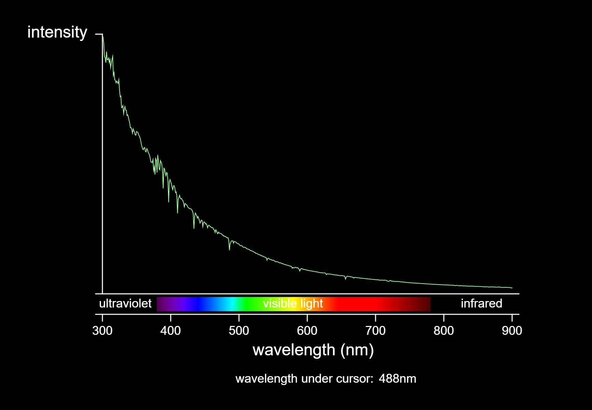
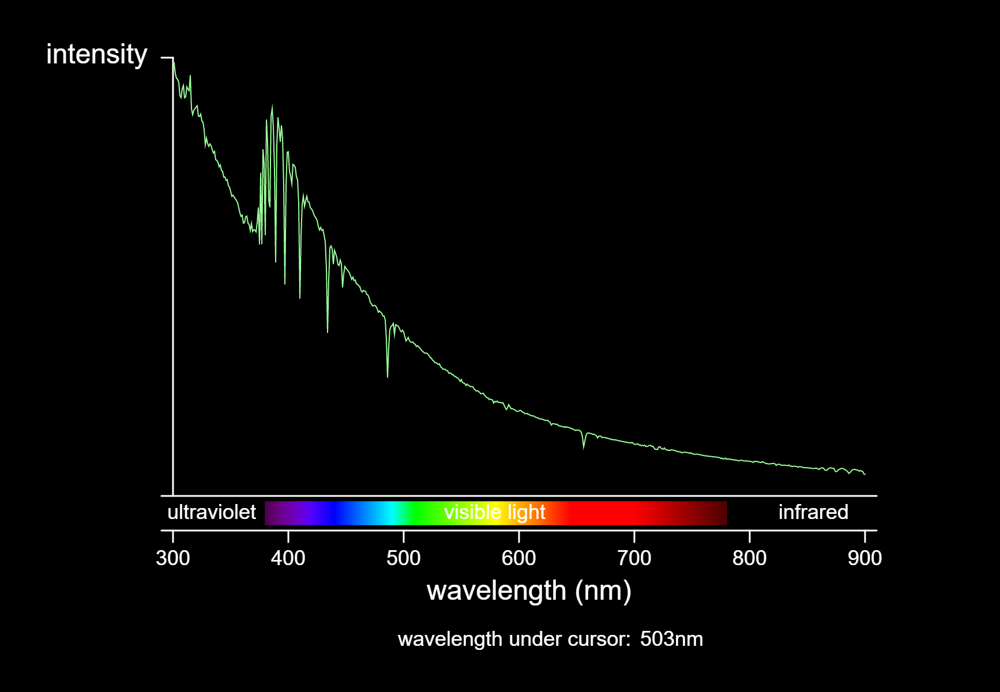
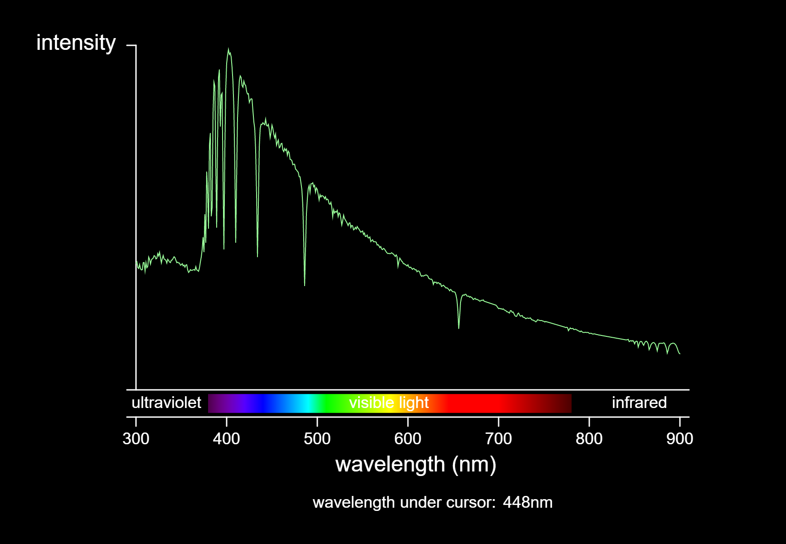
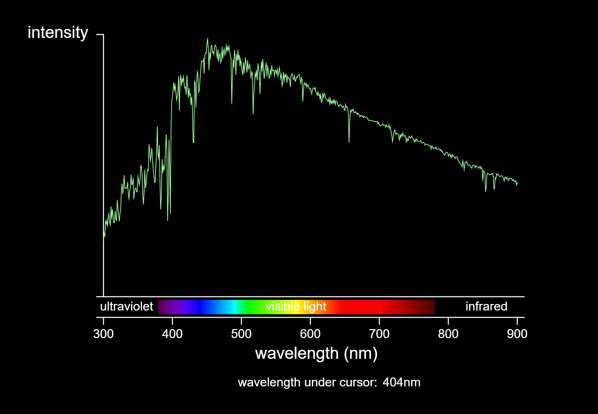
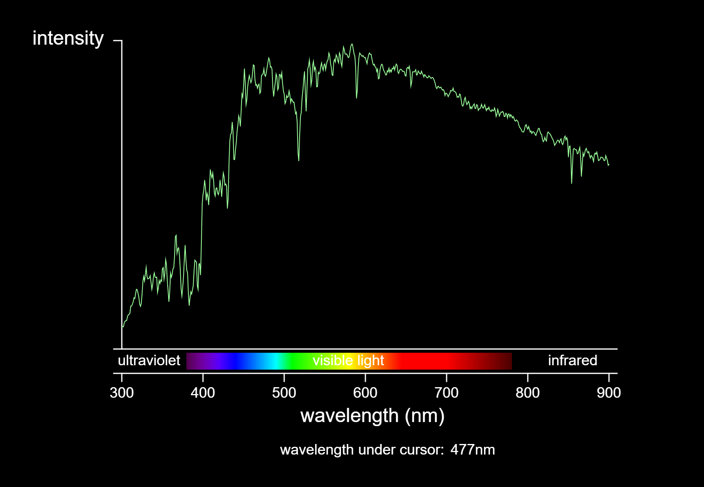

# Classification of Stars

Not all stars are like our sun (if you need a reminder). Thus, we need to organise them into classes. Now, we will see
how this has been done.

## Spectral Class

A spectral class is a letter denoting the star’s ionisation state. In simple terms, it just
means how hot the star’s surface temperature is. In order of decreasing surface temperature,
there are the O, B, A, F, G, K and M classes for the Morgan-Keenan System of classification.
Most stars are classified under this system. O and B represent the bluest, hottest stars, A
and F represent the white stars, G yellow, K orange and M red.

A commonly used mnemonic to remember this is: "**O**h, **B**e **A** **F**ine Girl, **K**iss **M**e".
But since Singapore’s education system is an extremely demanding, rigourous and competitve one as compared to other countries’,
for most Singaporean I'm sure that this is far more memorable: "**O**h **B**oy, **A**n **F** **G**rade
**K**ills **M**e".

!!! note "No one asked"

    The most memorable mnemonic is **O**bama **B**ought **A** **F**reaking **G**iant **K**illing **M**achine

Astronomers further subdivide each lettered spectral classification into 10 subdivisions, using 0-9.
**The lower the number, the hotter the star**. e.g. Sun (G2) is hotter than a G3 but cooler than a G1

??? example "Familiar examples"

    | spectral class | surface temperature (K) | example                              | intrinsic color |
    | -------------- | ----------------------- | ------------------------------------ | -------------- |
    | O              | 30,000 - 60,000                  | Mintaka (O9)*                        | Blue |
    | B              | 10,000 - 30,000                  | Rigel (B8)                           | Blue-White |
    | A              | 7500 - 10,000                  | Vega (A0), Sirius(A1)                | White |
    | F              | 6000 - 7500                    | Canopus (F0)                         | Yellow-White |
    | G              | 5000 - 6000                    | Sun (G2), Alpha Centauri (G2)        | Yellow |
    | K              | 3500 - 5000                    | Arcturus (K2), Aldebaran (K5)        | Yellow-Orange |
    | M              | < 3500                    | Betelgeuse (M2), Barnard's star (M5) | Red |

    *Mintaka (Delta Orionis, or the dimmest star in Orion's Belt) is actually a multiple star system. Mintaka Aa1 is the O9 star. [More examples](https://en.wikipedia.org/wiki/O-type_star#Examples)

The system can be extended to include other stars. W is a spectral class that comes
before O and describes Wolf-Rayet stars, which are extremely hot and bluish, sometimes
characterised by luminosities so intense that outer layers are occasionally blown away by its
own stellar wind.

After M we can insert even more spectral classes for cooler stars. These stars are
generally failed stars that we call brown dwarves, stars that don’t have enough energy to
start nuclear fusion in their cores.

In order of decreasing temperature, there are the L, T and Y brown dwarf stars. Y class brown dwarves in particular
are ultra-cool, with surface temperatures going down to below 600 K. These will be discussed further in the section on
stellar evolution.

## Classifying Stars

Stars can be classified based on their spectral class, but within each spectral class there are
subdivisions, with 0 being the hottest and 9 being the coolest. So a G0 star is hotter than a G9 star, and an A5
star is cooler than an A3 star. Our sun is considered a G2 star.

In the Morgan-Keenan Classification, there is also a luminosity class as well.

| Luminosity Class | Star Type          |
| ---------------- | ------------------ |
| I                | Supergiants        |
| II               | Bright Giants      |
| III              | Giants             |
| IV               | Sub Giants         |
| V                | Main Sequence Star |

Most stars fall under V, and the convention is to mention the luminosity class after the spectral class.

For our sun that would be G2V. For a star like Betelgeuse, it would be M2I, since it’s a red supergiant.

## Stellar Spectra (Graphs)
The following is a representation of the Stellar Spectra, broken down by the Spectral and Luminosity Classes as stated above.

=== "O9V"
	

=== "B3V"
    

=== "B8V"
    

=== "A0V"
    

=== "A3V"
    
    
=== "A7V"
    

=== "F2V"
    

=== "F8V"
    

=== "G2V"
    

=== "G8V"
    

=== "K2V"
    

=== "K7V"
    
    
=== "M2V"
    

=== "M6V"
    

**Notes**:

- This data comes from the stellar spectra library described by A.J. Pickles (Proc. Ast. Soc. Pacific, 1998).
- These spectra are not displayed on a fixed intensity scale. The height of each spectrum is stretched to fill the display.
- To display a different spectrum, click a button on the left. By default, the spectrum of a G2V star like the Sun is shown.
- To measure the wavelength of a feature in the spectrum, click or click-and-drag. The wavelength is shown at the bottom of the display.
- For reference, visible light ranges from 400 to 700 nanometers. Ultraviolet is shorter in wavelength, infrared is longer.