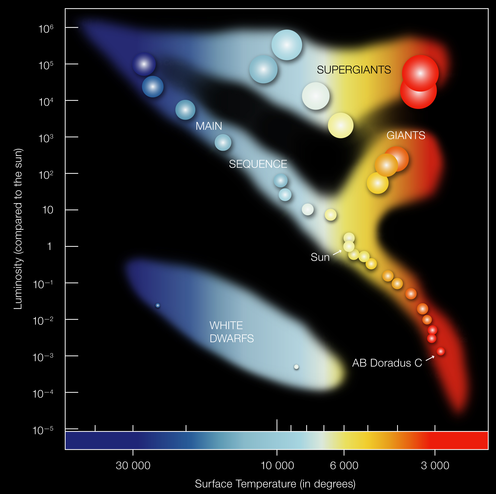

# Hertsprung-Russell Diagram

If we plot all the stars on a single graph, with the y-axis as luminosity, and the x-axis as colour, we get the Hertzsprung-Russell diagram, named after Ejnar Hertzsprung and Henry Norris Russell. Note that interestingly temperature in fact decreases when we move to the right. Why? Don't ask me.

Most of the stars lie on what we call the Main Sequence, which runs from top left to bottom right. Main sequence stars are stars that have achieved equilibrium after coming out of the protostar stage which will be discussed later. There are also other stars which lie outside the main sequence. They will be discussed later.
